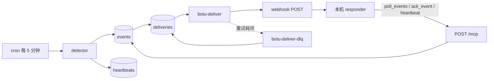
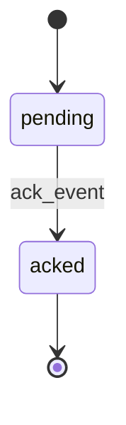
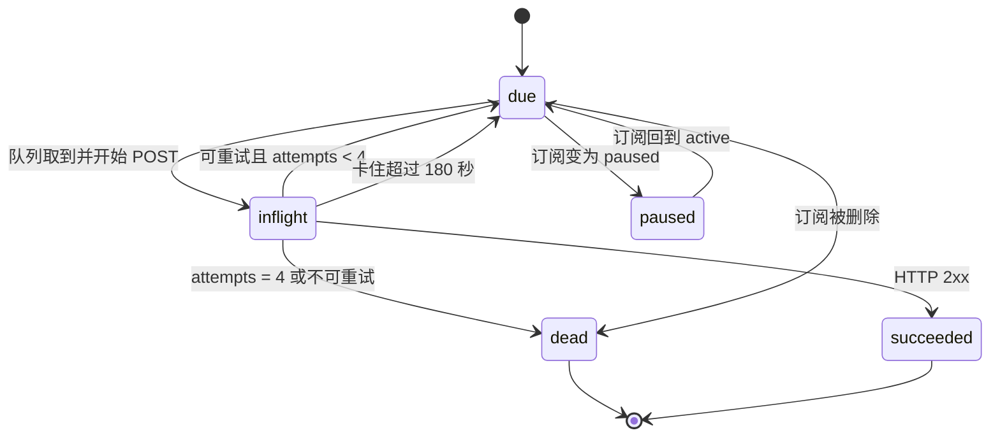

# Botu 数据层 Phase 2：watchdog 与唤起合同

状态：设计文档。实现时只追加对象，不改 Phase 1 已有表、15 个工具、canonical URL 和 `GET /health` 的行为。本文不修改 `DESIGN.md`、`schema.sql`、`worker.js`、`wrangler.toml`。

Phase 2 在 `botu-data` Worker 上加一条 provider-neutral 的唤起总线。Cloudflare 侧负责发现情况、把事件写入 D1、按订阅推送 webhook。agent 服务商只出现在用户自己电脑上的 responder 里。换服务商时换 responder，检测、事件行、订阅和未 ack 的事件继续留在原来的 Worker 上。

单用户、单 agent。事件的消费者是 bot，不是给人看的通知中心。

## 原则

- 事件的 `type`、`payload`、MCP 方法、webhook 头里不出现任何 agent 服务商的名字。`source` 只有 `detector` 和 `emit`。默认 `agent_id` 是 `bot:main`，与 Phase 1 的 `created_by` 用词一致。
- 同一次唤醒里 bot 的需求和人的需求冲突时，先完成 bot 的需求。`watchdog.*` 必须把 agent 拉起来。对人免打扰、推迟到白天再看，只适用于 agent 已经接住 watchdog 之后的日历事项，不适用于丢弃或推迟 `watchdog.*`。
- 进度只有 `ack_event`。webhook 的 2xx 只表示唤醒请求被收进了 responder，不表示事情已经处理。
- 邮件归档 Worker 的代码、D1、R2、队列和 secrets 保持原样。Phase 2 的 queue DLQ 检查对象是 botu 自己的投递死信。

## 组件



| 组件 | 跑在哪里 | 职责 |
| --- | --- | --- |
| detector | Worker `scheduled` | 写心跳过期、投递死信、日历到期这三类事件 |
| events / subscriptions / deliveries / heartbeats | 同一个 D1 `botu-data` | 唤起总线的状态 |
| webhook-out | 队列消费者 | 按订阅把事件 POST 出去，失败则退避，耗尽后记死信 |
| responder | agent 自己的电脑 | 心跳、拉事件、决策、执行、ack。唯一知道服务商 SDK 的地方 |

Phase 2 不新增给人调用的 HTTP 路径。`POST /mcp` 与三条 canonical URL、`GET /health` 仍是仅有的 fetch 路由。`scheduled` 和 `queue` 是 Worker 处理器，不是 URL。

## 常量

| 名字 | 值 |
| --- | --- |
| cron | `*/5 * * * *`（最坏发现延迟约 5 分钟，加上一次执行） |
| 心跳 TTL 默认 / 最小 / 最大 | 600 / 120 / 86400 秒 |
| 日历回看 | 7 天。只处理 `start_utc` 落在 `(now - 7d, now]` 的行 |
| poll `limit` 默认 / 最大 | 20 / 100 |
| `visibility_seconds` 默认 / 最小 / 最大 | 120 / 30 / 900 |
| 一次 poll 最多扫描的可见行 | 500 |
| detector 每一类每轮最多插入 | 50 |
| webhook 超时 | 10 秒，`redirect: "manual"`，不跟随重定向 |
| 失败退避 | 第 1 次失败后 60 秒，第 2 次后 120 秒，第 3 次后 240 秒，第 4 次失败记死信 |
| 签名时间窗 | 300 秒 |
| `inflight` 视为卡住 | 180 秒 |
| 队列消息丢失后的补投 | `queued_at` 早于 now − 900 秒且 `next_attempt_at <= now` |
| payload 序列化上限 | 4096 字节 |
| 时间文本 | `Date.prototype.toISOString()`，形如 `2026-09-30T04:00:00.000Z`。字符串序等于时间序 |

## 标识

沿用 Phase 1：前缀 + 12 位 `[a-z0-9]`，生成算法与现有 `idFromBytes` 相同。实现时把前缀白名单扩成 `cal_`、`ctc_`、`note_`、`evt_`、`sub_`、`dlv_`。Phase 1 三个前缀的格式和校验不变。

| 对象 | 前缀 |
| --- | --- |
| 总线事件 | `evt_` |
| 订阅 | `sub_` |
| 一次 webhook 投递 | `dlv_` |

`lease_token` 不是这套 id。它是 16 字节随机数的小写 hex（32 个字符）。

`type` 语法：`^[a-z][a-z0-9_]{0,30}(\.[a-z][a-z0-9_]{0,30})+$`，整段最长 64，至少两段。

`dedupe_key` 语法：`^[A-Za-z0-9:._-]{1,200}$`。日历键里的 `start_utc` 原样使用 `toISOString()`，因此允许大写的 `T` 和 `Z`。

## events

事件是「有一件事需要 bot 处理」。行在 ack 之前一直是待办。webhook 失败不会把行删掉，也不会把它标成已处理。

```sql
CREATE TABLE IF NOT EXISTS events (
  id TEXT PRIMARY KEY,
  type TEXT NOT NULL,
  payload TEXT NOT NULL,
  status TEXT NOT NULL DEFAULT 'pending',
  dedupe_key TEXT NOT NULL,
  created_at TEXT NOT NULL,
  not_before TEXT NOT NULL,
  acked_at TEXT,
  leased_until TEXT,
  lease_token TEXT,
  poll_count INTEGER NOT NULL DEFAULT 0,
  source TEXT NOT NULL,
  updated_at TEXT NOT NULL
);
CREATE UNIQUE INDEX IF NOT EXISTS idx_events_dedupe_open
  ON events(dedupe_key) WHERE status = 'pending';
CREATE INDEX IF NOT EXISTS idx_events_poll
  ON events(status, not_before, created_at, id);
CREATE INDEX IF NOT EXISTS idx_events_type_created
  ON events(type, created_at);
```

| 列 | 含义 |
| --- | --- |
| `id` | `evt_` + 12 位 |
| `type` | 见下方事件类型 |
| `payload` | JSON 对象的文本。数组、字符串、数字、布尔、null 都不允许作为顶层。用下面的稳定序列化写入 |
| `status` | `pending` 或 `acked` |
| `dedupe_key` | 幂等键。`status = 'pending'` 时全表唯一 |
| `created_at` | Worker 写入时的 UTC |
| `not_before` | 生产者规定的可见时间。poll 和 webhook 都要 `not_before <= now`。detector 写的事件等于 `created_at` |
| `acked_at` | ack 成功时的 UTC，此前为 NULL |
| `leased_until` | 本次 poll 认领的到期时间。NULL 表示无人认领 |
| `lease_token` | 本次认领的令牌。ack 时必须带回。不出现在 webhook 正文里 |
| `poll_count` | 被 poll 认领的次数。大于 1 表示重新投递 |
| `source` | `detector` 或 `emit` |
| `updated_at` | 每次状态变化都改 |

`not_before` 只管「什么时候开始可见」。认领期限放在 `leased_until`，避免一次 poll 把 Phase 3 提前写入的计划时间覆盖掉。

插入：

```sql
INSERT INTO events (
  id, type, payload, status, dedupe_key, created_at, not_before, source, updated_at
) VALUES (?, ?, ?, 'pending', ?, ?, ?, ?, ?)
ON CONFLICT(dedupe_key) WHERE status = 'pending' DO NOTHING;
```

`meta.changes = 0` 表示已经有一条同键的 `pending` 行，调用方停止，不再扇出 webhook。ack 把 `status` 改成 `acked` 之后，该键离开部分唯一索引，同一问题的下一次发生可以再插入一行，id 不同。

### 事件状态机



`acked` 是终态。没有从 `acked` 回到 `pending` 的路径。投递死信不是事件状态，记在 `deliveries.state`。

认领不改变 `status`：

1. poll 选中一行后把 `leased_until` 设为 now + `visibility_seconds`，换上新的 `lease_token`，`poll_count` 加 1。
2. 在 `leased_until` 之前，这一行对后续 poll 不可见。
3. 到期仍是 `pending` 时，行重新可见，`poll_count` 会再增加。
4. ack 成功则 `status = acked`，`acked_at = now`，`leased_until` 和 `lease_token` 置 NULL。

### Phase 2 由 detector 写入的类型

| type | dedupe_key | 谁写入 |
| --- | --- | --- |
| `watchdog.heartbeat_stale` | `watchdog.heartbeat_stale:{agent_id}` | detector |
| `watchdog.queue_dlq` | `watchdog.queue_dlq:{delivery_id}` | detector |
| `calendar.due` | `calendar.due:{calendar_event_id}:{start_utc}` | detector |

`watchdog.*` 与 `calendar.due` 只能由 detector 的内部插入函数写入。`emit_event` 拒绝这两类。

`watchdog.queue_dlq` 不扇出 webhook。它的存在原因就是 webhook 路径已经失败，再 POST 一次会打到同一个坏地址上。responder 用 poll 取它。

### payload

detector 的 payload 只有下列字段，缺字符串时用 `""`，缺可选外键时用 `null`。

`watchdog.heartbeat_stale`：

```json
{
  "agent_id": "bot:main",
  "observed_at": "2026-09-30T00:00:00.000Z",
  "seen_at": "2026-09-29T23:49:30.000Z",
  "stale_for_seconds": 30,
  "ttl_seconds": 600
}
```

`stale_for_seconds = max(0, floor((now - Date.parse(seen_at)) / 1000) - ttl_seconds)`。

`watchdog.queue_dlq`：

```json
{
  "attempts": 4,
  "dead_reason": "retries_exhausted",
  "delivery_id": "dlv_0123456789ab",
  "event_id": "evt_0123456789ab",
  "event_type": "calendar.due",
  "last_error": "timeout",
  "queue": "botu-deliver-dlq",
  "subscription_id": "sub_0123456789ab"
}
```

`calendar.due`：

```json
{
  "all_day": false,
  "calendar_event_id": "cal_0123456789ab",
  "end_utc": "2026-09-30T05:00:00.000Z",
  "location": null,
  "path": "/cal/cal_0123456789ab",
  "start_utc": "2026-09-30T04:00:00.000Z",
  "timezone": "Asia/Shanghai",
  "title": "复诊"
}
```

`path` 是路径，不是绝对 URL。cron 没有请求 origin，不拼主机名。正文不放 `notes`（Phase 1 允许到 10 万字符）。responder 要详情时调用已有的 `get_event`。

稳定序列化：对象的键按 UTF-16 码元升序；数组保持原顺序；字符串、数字、布尔、null 用 `JSON.stringify` 的转义；不含空白。拒绝 `undefined`、`NaN`、`Infinity`。嵌套对象递归使用同一规则。webhook 签名覆盖的是这套规则产生的原始字节。

拒绝写入 payload 的规则见「安全」。

## subscriptions

一条订阅是一个消费者端点。`mode = poll` 只拉。`mode = webhook` 在可拉之外再 POST 到 `url`。两种 mode 在 `status = active` 时都可以作为 `poll_events` 的 `subscription_id`。

```sql
CREATE TABLE IF NOT EXISTS subscriptions (
  id TEXT PRIMARY KEY,
  mode TEXT NOT NULL,
  status TEXT NOT NULL DEFAULT 'active',
  url TEXT,
  event_types TEXT NOT NULL DEFAULT '["watchdog.*","calendar.*"]',
  secret_sealed TEXT,
  watch_heartbeat INTEGER NOT NULL DEFAULT 1,
  agent_id TEXT NOT NULL DEFAULT 'bot:main',
  created_at TEXT NOT NULL,
  updated_at TEXT NOT NULL
);
CREATE INDEX IF NOT EXISTS idx_subs_status_mode
  ON subscriptions(status, mode);
```

| 列 | 含义 |
| --- | --- |
| `id` | `sub_` + 12 位 |
| `mode` | `poll` 或 `webhook`。创建后不可改 |
| `status` | `active` 或 `paused` |
| `url` | `webhook` 必填，`poll` 必须为 NULL |
| `event_types` | JSON 字符串数组，过滤器 |
| `secret_sealed` | webhook HMAC 密钥的 AES-GCM 密文。`poll` 为 NULL。读工具不返回这一列 |
| `watch_heartbeat` | 1 或 0。为 1 且 `active` 时，detector 监视 `agent_id` 的心跳 |
| `agent_id` | `^bot:[a-z0-9][a-z0-9_-]{0,31}$`，默认 `bot:main` |

`status`：

- `active`：允许 poll；`webhook` 模式会投递。
- `paused`：不投递。`poll_events` 直接 `-32602` `subscription paused`，避免暂停被误解成「没有事件」。配置保留。`watch_heartbeat` 在 paused 时不参加心跳检查。

删除是硬删除，与 contacts 一样。

### 事件类型过滤

`event_types` 是 1 到 20 个字符串。每一项要么是 `*`，要么是精确 `type`，要么是以 `.*` 结尾的前缀（`watchdog.*` 匹配 `watchdog.heartbeat_stale`）。匹配是「有一项命中即可」。

省略该参数时，默认 `["watchdog.*","calendar.*"]`。这个默认让 Phase 2 的订阅认领不到 `reminder.*`，那些行会一直 `pending`，等 Phase 3 的订阅来拉。要全部类型必须显式传 `["*"]`。

过滤器在认领之前应用。不匹配的行不会被写上 `leased_until`。

后创建的订阅不补发历史 webhook。它下次 poll 仍能看到所有匹配的 `pending` 行。

## deliveries 与 heartbeats

webhook 是一对（事件，订阅）的投递，所以状态不放在 `events` 上。一个事件可以对应零行或多行 `deliveries`。

```sql
CREATE TABLE IF NOT EXISTS deliveries (
  id TEXT PRIMARY KEY,
  event_id TEXT NOT NULL,
  subscription_id TEXT NOT NULL,
  state TEXT NOT NULL,
  attempts INTEGER NOT NULL DEFAULT 0,
  next_attempt_at TEXT,
  queued_at TEXT,
  inflight_at TEXT,
  last_error TEXT,
  dead_reason TEXT,
  created_at TEXT NOT NULL,
  updated_at TEXT NOT NULL,
  UNIQUE(event_id, subscription_id)
);
CREATE INDEX IF NOT EXISTS idx_deliveries_due
  ON deliveries(state, next_attempt_at);

CREATE TABLE IF NOT EXISTS heartbeats (
  agent_id TEXT PRIMARY KEY,
  seen_at TEXT NOT NULL,
  ttl_seconds INTEGER NOT NULL,
  updated_at TEXT NOT NULL
);
```

`last_error` 只允许：`timeout`、`network`、`handler_crash`、`seal_error`、`http_` 加三位数字。最长 16。不存响应体。

`dead_reason`：`retries_exhausted`、`http_status`、`subscription_deleted`、`seal_error`。

心跳行不存在表示这个 `agent_id` 还没报到，detector 不报过期。第一笔 `heartbeat` 成功之后才开始计时。

## 投递状态机



`attempts` 是失败次数，成功的那一次不加。一条投递最多 POST 4 次（初次加上 3 次退避）。

队列消息体只有 `{"delivery_id":"dlv_..."}`。密钥、payload、lease 都不进队列。

扇出发生在事件**新插入成功**时：对每条 `status = active`、`mode = webhook`、过滤器命中的订阅插入一行 `deliveries`，`state = due`。`watchdog.queue_dlq` 跳过扇出。`not_before <= now` 时把 `queued_at` 设为 now 并立刻 `send`；`send` 失败则把 `queued_at` 置回 NULL，留给 cron。`not_before` 在未来时，`next_attempt_at = not_before`，`queued_at` 留 NULL，等 cron 再入队。

`UNIQUE(event_id, subscription_id)` 保证同一对只投递一条逻辑记录。队列本身至少一次，消费者用状态比较消除重复消息，见 webhook 一节。

## 至少一次、幂等、断点续拉

三件事分开：

| 机制 | 作用 |
| --- | --- |
| `dedupe_key` 的部分唯一索引 | 同一问题在被 ack 之前只产生一行 |
| `ack_event` | 唯一的完成标记。重复 ack 返回成功 |
| poll 的 `cursor` | 同一次唤醒里的翻页，以及重启之后把未 ack 的行再交出来 |
| `leased_until` | 把刚发出去、还没 ack 的行暂时藏起来，避免两个 poll 同时执行 |
| responder 本地日志 | 副作用以 `event.id` 为幂等键。重新投递时跳过已执行的副作用，只补 ack |

服务端不保存「客户端已经看到哪一条」。订阅表上没有 resume 列。客户端可以不持久化 cursor。

### cursor

编码：`v1.` + base64url（无填充）(`created_at` + `\n` + `id`)。

比较元组 `(created_at, id)`：先比时间文本，相等再比 id 字节序。

`poll_events` 的选择顺序：

1. 订阅必须存在、`mode` 为 `poll` 或 `webhook`、`status = active`。否则按「MCP 工具」里的错误返回，不读事件表。
2. 可见行：`status = 'pending'` 且 `not_before <= now` 且（`leased_until IS NULL` 或 `leased_until <= now`）且类型过滤器命中。
3. `cursor` 省略或空串：按 `(created_at, id)` 从最老的可见行开始，取 `limit` 条。
4. `cursor` 有值：先取元组 `<= cursor` 的可见行（这些是已经翻过页但仍未 ack、租约已过期的行），再取元组 `> cursor` 的可见行。两部分都按 `(created_at, id)` 升序，合计最多 `limit` 条。先填满「cursor 之前」的部分。
5. 用 `DB.batch` 对选中的 id 做认领：`UPDATE ... SET leased_until = ?, lease_token = ?, poll_count = poll_count + 1, updated_at = ? WHERE id = ? AND status = 'pending' AND not_before <= ? AND (leased_until IS NULL OR leased_until <= ?)`。只有 `changes = 1` 的行进入响应。
6. `next_cursor` 是响应里最后一条的编码。本页为空时，`next_cursor` 等于入参 cursor；入参也没有则为 `null`。
7. `has_more`：认领之后还存在别的可见且匹配的行。
8. 扫描上限 500。到达上限仍有未看的行时，`has_more = true`，`next_cursor` 停在最后一条已扫描的行，哪怕它因为过滤器没被认领。

因此：

- 每次新唤醒不带 cursor，就会从最老的未 ack 可见行再来一遍。这是正常路径。
- 同一次唤醒里用 `next_cursor` 翻页。已经认领的行有租约，不在「可见」集合里，所以可以先把若干页拉完，再按本地优先级 ack。`visibility_seconds` 必须盖住这一整段拉页和执行的时间。
- 若 responder 把 `next_cursor` 存过进程重启，步骤 4 仍会把租约过期且位于 cursor 之前的未 ack 行放进本页。至少一次不依赖客户端把 cursor 用对。
- cursor 不是 ack。只前进 cursor、不调用 `ack_event`，那些行会在租约到期后再次出现。

空页且仍有 `pending` 行被租约藏住时，`retry_after_seconds` 为距离最近一个 `leased_until` 的秒数，至少为 1。没有任何 `pending` 行时为 0。

### ack

```sql
UPDATE events
SET status = 'acked', acked_at = ?, leased_until = NULL, lease_token = NULL, updated_at = ?
WHERE id = ? AND status = 'pending' AND lease_token = ?;
```

- `changes = 1`：返回 `{id, status:"acked", idempotent:false, ack_cursor}`。`ack_cursor` 是这一行的 cursor 编码，只描述这一条，不是「这一条之前的都完成了」。
- `changes = 0` 且该 id 已经是 `acked`：返回 `{id, status:"acked", idempotent:true, ack_cursor}`，不检查 `lease_token`。这是 ack 请求自己重试。
- `changes = 0` 且仍是 `pending`：`-32602` `lease mismatch`。调用方重新 poll，用新令牌再 ack。本地日志里已经执行过的 id 只补 ack，不再做副作用。
- id 不存在，或前缀格式不对：`-32602` `not found`。格式错误与 Phase 1 一样先报 `id is required`。

### 时间线

`evt_a` 然后 `evt_b` 都是 `pending`，`limit = 1`，租约 120 秒。

| 时刻 | 调用 | 结果 |
| --- | --- | --- |
| T1 | `poll_events` 不带 cursor | 得到 `evt_a`，`poll_count = 1`，`next_cursor = c(a)` |
| T2 | `ack_event(evt_a)` | `evt_a` 变为 `acked` |
| T3 | 进程退出，没拉 `evt_b` | 行仍是 `pending`，租约未设置 |
| T4 | 重启后 poll 不带 cursor | 得到 `evt_b` |
| T5 | poll 到 `evt_b` 后崩溃，没 ack | 租约盖住 `evt_b` |
| T6 | 立刻再 poll | `events: []`，`retry_after_seconds > 0` |
| T7 | 租约到期后再 poll | 再次得到 `evt_b`，`poll_count = 2` |

## MCP 工具

协议仍是 `POST /mcp`，JSON-RPC 2.0，`initialize` 的 `protocolVersion` 仍是 `2025-06-18`，`serverInfo.version` 仍是 `1.0.0`。`notifications/*` 仍是 HTTP 202 和空 body。工具结果仍包在 `{content:[{type:"text",text:<JSON>}]}`。未知参数 `-32602`。校验失败不写库。

鉴权复用 `DATA_MCP_TOKEN`。`Authorization: Bearer <DATA_MCP_TOKEN>`，比较函数用现有的 `timingSafeEqual`。无 token 或 token 不对返回 HTTP 401，发生在读 body 和 D1 之前。不新增第二把 MCP 钥匙：换 responder 时把同一把 token 配进新进程；要作废旧进程就在 Worker secret 里轮换这一把，再更新 responder。

Phase 1 的 15 个工具名字、参数、错误和返回值不变。`tools/list` 在它们后面追加下面 10 个。

### poll_events

`poll_events({subscription_id, cursor?, limit?, visibility_seconds?})`

| 参数 | 规则 |
| --- | --- |
| `subscription_id` | 必填，`sub_` + 12 位 |
| `cursor` | 省略、`""` 或 `v1.` 编码。其它值 `-32602` `cursor is invalid` |
| `limit` | 默认 20，最大 100，整数，`< 1` 拒绝 |
| `visibility_seconds` | 默认 120，最小 30，最大 900，整数 |

返回：

```json
{
  "events": [
    {
      "id": "evt_0123456789ab",
      "type": "calendar.due",
      "payload": {},
      "dedupe_key": "calendar.due:cal_0123456789ab:2026-09-30T04:00:00.000Z",
      "created_at": "2026-09-30T04:00:00.000Z",
      "not_before": "2026-09-30T04:00:00.000Z",
      "lease_token": "0123456789abcdef0123456789abcdef",
      "leased_until": "2026-09-30T04:02:00.000Z",
      "poll_count": 1
    }
  ],
  "next_cursor": "v1....",
  "has_more": false,
  "retry_after_seconds": 0
}
```

`events` 的顺序是 `(created_at, id)`，不是优先级。优先级由 responder 在本地排。响应里没有 `secret_sealed`，没有订阅密钥，没有 `DATA_MCP_TOKEN`。

错误：`not found`，`subscription paused`，`cursor is invalid`。

### ack_event

`ack_event({id, lease_token})`

两个参数都必填。`lease_token` 是 32 位小写 hex。返回见上一节。

### heartbeat

`heartbeat({agent_id?, ttl_seconds?})`

`agent_id` 默认 `bot:main`。`ttl_seconds` 默认 600。对 `heartbeats` 做 upsert，`seen_at = now`。返回 `{agent_id, seen_at, ttl_seconds}`。

这一调用是报到，不是事件 ack。它不修改 `events`。

### emit_event

`emit_event({type, dedupe_key, payload?, not_before?})`

给 detector 以外的生产者用，Phase 3 的提醒写入走这里，不必再加传输方式。

| 参数 | 规则 |
| --- | --- |
| `type` | 符合语法，且不是 `watchdog.*`，也不是 `calendar.due` |
| `dedupe_key` | 符合语法，且不以 `watchdog.` 或 `calendar.due:` 开头 |
| `payload` | 对象，默认 `{}`。按安全一节检查，稳定序列化后不超过 4096 字节 |
| `not_before` | 省略则等于 `created_at`。允许范围是 `[now - 7 天, now + 366 天]`，写入前归一成 UTC |

`source = emit`。新插入成功才扇出 webhook。返回 `{id, created:true}` 或已存在的 `{id, created:false}`。`created:false` 时不改已有行的 payload。

### 订阅管理

`create_subscription({mode, url?, event_types?, watch_heartbeat?, agent_id?})`

- `mode` 必填。
- `webhook`：`url` 必填，通过「安全」里的 URL 检查；生成 `whsec_` + 标准 base64（32 随机字节，带填充）的密钥，用 `SUBSCRIPTION_SEAL` 密封后写入 `secret_sealed`。
- `poll`：禁止带 `url`。`secret_sealed` 为 NULL。
- 密封密钥缺失或长度不是 32 字节时，`webhook` 创建失败，返回 JSON-RPC `-32603` `subscription seal is not configured`，不插入行。`poll` 不读这把密钥。
- 返回 `{id, mode, status:"active", secret?}`。`secret` 只在这次响应里出现，只对 `webhook` 出现。

`get_subscription({id})` 返回 `{id, mode, status, url, event_types, has_secret, watch_heartbeat, agent_id, created_at, updated_at}`。`has_secret` 是布尔。没有 `secret` 字段。未找到是 `-32602` `not found`。

`list_subscriptions({limit?})`：`limit` 默认 20，最大 100。按 `created_at, id` 升序。每条与 get 的字段相同。

`update_subscription({id, url?, event_types?, status?, watch_heartbeat?, agent_id?})`

- 至少改一个字段，否则 `-32602` `no fields to update`。
- 禁止出现 `mode`。
- `url` 只对 `webhook` 订阅合法，并重新做 URL 检查。
- `status` 只能是 `active` 或 `paused`。
- 改为 `paused`：该订阅下 `state IN ('due','inflight')` 的投递改为 `paused`。
- 改为 `active`：该订阅下 `state = 'paused'` 的投递改回 `due`，`next_attempt_at` 置 NULL，交给 cron 入队。
- 返回与 get 相同的对象。

`delete_subscription({id})`：硬删除订阅行。把它名下未终态的投递标成 `dead`，`dead_reason = subscription_deleted`。这种死信不产生 `watchdog.queue_dlq`。返回 `{id, deleted:true}`。未找到是 `not found`。已经在队列里的消息稍后被消费者看到订阅不存在时，直接 ack，不再 POST。

`rotate_subscription_secret({id})`：仅 `webhook`。生成新密钥，用同一订阅 id 作 AAD 重新密封，旧密钥立即失效。返回 `{id, secret}`，密钥只此一次。`poll` 订阅调用它是 `-32602` `subscription has no webhook secret`。

## webhook-out

### 签名

密钥材料是创建或轮换时返回的整段字符串（含 `whsec_` 前缀）的 UTF-8 字节。不对这段 base64 做解码。这与邮件 Worker 的 Svix 用的是两套材料，实现时分开写。

正文是下面这个对象的稳定 JSON，键顺序固定，无空白：

```json
{
  "id": "evt_...",
  "type": "calendar.due",
  "dedupe_key": "calendar.due:...",
  "created_at": "...",
  "not_before": "...",
  "payload": {}
}
```

`payload` 内部键已按 UTF-16 排序。签名字符串是 `timestamp + "." + body`，`timestamp` 是十进制 Unix 秒。HMAC-SHA256，输出小写 hex。

```http
POST /path HTTP/1.1
Content-Type: application/json; charset=utf-8
User-Agent: botu-data-webhook/1
X-Botu-Timestamp: 1759190400
X-Botu-Event-Id: evt_0123456789ab
X-Botu-Subscription-Id: sub_0123456789ab
X-Botu-Signature: v1=<64 hex chars>
```

正文里没有 `lease_token`、`secret`、密封列或 token。接收方用**原始字节**验签，不要先 `JSON.parse` 再序列化。`|now - timestamp| > 300` 则拒绝。比较用恒定时间。验签失败回 401，并且不做副作用。

验签通过后，接收方只负责把本进程的 poll 循环叫醒，然后回 2xx。副作用放在 poll 循环里，这样 webhook 和 poll 不会各执行一次。

### 发送与重试

消费者处理 `botu-deliver`：

1. 按 `delivery_id` 读投递、事件、订阅。行不存在，或 `state` 已是 `succeeded` 或 `dead`：ack 消息，不 POST。
2. 订阅不是 `active` 的 webhook：ack 消息。若订阅是 `paused` 且投递还是 `inflight`，把投递改回 `paused`。
3. 比较并设置：`state` 从 `due` 或 `inflight` 变成 `inflight`，写下 `inflight_at`。比较失败则 ack 消息（另一条并发消息已经负责）。
4. 解密密钥。解密失败：`state = dead`，`dead_reason = seal_error`，`last_error = seal_error`，ack，不 POST。
5. POST，超时 10 秒，重定向不跟随。3xx 视为失败，不读 Location，不把正文送到第二个主机。
6. 2xx：`state = succeeded`，ack。事件保持 `pending`，直到 `ack_event`。
7. 可重试：网络错误、超时、408、429、5xx。`attempts` 加 1。
   - `attempts` 为 1、2、3：`state = due`，`next_attempt_at = now + 60/120/240`，`last_error` 写成 `timeout`、`network` 或 `http_429` 这类令牌，然后 `message.retry({delaySeconds})`，并把 `queued_at` 更新为 now。
   - `attempts >= 4`：`state = dead`，`dead_reason = retries_exhausted`，ack。
8. 其它 4xx：不重试。`state = dead`，`dead_reason = http_status`，`last_error = http_<code>`，ack。

HTTP 错误不要 throw。throw 只留给程序错误。`max_retries = 3`，throw 的消息进入 `botu-deliver-dlq`。

死信消费者不再 POST。它把对应投递标成 `dead` / `retries_exhausted`；若 `last_error` 还是 NULL，写成 `handler_crash`。已经 `succeeded` 或 `dead` 的行只 ack。

cron 补投，避免队列保留期过了之后 D1 里还挂着 `due`：

```sql
SELECT id FROM deliveries
WHERE state = 'due'
  AND (next_attempt_at IS NULL OR next_attempt_at <= ?)
  AND (queued_at IS NULL OR queued_at <= ?)
LIMIT 50
```

第二个人参是 now − 900 秒。选中后把 `queued_at` 设为 now 再 `send`。900 秒大于最长退避 240 秒，所以正常等待中的 `retry()` 不会被补投一次。

`inflight_at <= now - 180 秒` 的行改回 `due`，`queued_at` 置 NULL，下一轮补投会重新 send。这覆盖消费者在 POST 之前被杀掉的情况。因此 POST 本身是至少一次；接收方用事件 id 去重。

## detector

`scheduled` 每 5 分钟跑一遍，顺序固定。每一类插入最多 50 行，剩下的下一轮再写。同一轮里用事件插入函数，借部分唯一索引去重。

1. 日历到期
2. 心跳
3. 投递死信 → `watchdog.queue_dlq`
4. 补投 `due` 的 deliveries，并回收卡住的 `inflight`

detector 不调用外部 agent，不改 contacts / calendar_events / notes 的列，不 ack 事件。条件恢复（心跳又回来了、日历被改期、人把订阅修好了）时，已有的 `pending` 行留着，等 responder 读完现场再 ack。条件再次变坏且旧行已经 ack 时，才会插入新 id。

### 心跳

```sql
SELECT agent_id FROM subscriptions
WHERE status = 'active' AND watch_heartbeat = 1
GROUP BY agent_id
```

对每个 `agent_id` 读 `heartbeats`。没有行：跳过。`Date.parse(seen_at) + ttl_seconds * 1000 >= now`：跳过。否则插入 `watchdog.heartbeat_stale`，键为 `watchdog.heartbeat_stale:{agent_id}`。

已经有一条同键 `pending` 时，本轮什么都不写，也不刷新 payload。responder 被拉起来之后自己读 `heartbeat` 的返回值或下一笔报到，判断人是否已经恢复；恢复了就 ack 这行过期事件。agent 一直没回来时，这一行靠 poll 租约重复出现，不会每 5 分钟新增一行。

### queue DLQ

```sql
SELECT id, event_id, subscription_id, attempts, dead_reason, last_error
FROM deliveries
WHERE state = 'dead' AND dead_reason != 'subscription_deleted'
ORDER BY updated_at ASC, id ASC
LIMIT 50
```

对每一行插入 `watchdog.queue_dlq`，键为 `watchdog.queue_dlq:{delivery_id}`。`event_type` 从对应事件行读取。找不到事件行就跳过这一条投递。

立即 4xx 和队列死信都走这个查询。`dead_reason` 区分 `http_status` 与 `retries_exhausted`。`subscription_deleted` 是操作者主动删的，不叫醒 bot。

这条 watchdog 事件本身不扇出。原始业务事件保持 `pending`，responder 继续用 poll 处理它。webhook 死了不等于业务事件已经完成。

### 日历到期未处理

```sql
SELECT id, title, start_utc, end_utc, timezone, all_day, location
FROM calendar_events
WHERE status = 'confirmed'
  AND start_utc <= ?
  AND start_utc >= ?
ORDER BY start_utc ASC, id ASC
LIMIT 50
```

窗口右端是 now，左端是 now − 7 天。`timezone` 仍只是展示字段，到期判断用 `start_utc`，不按上海时区换算。`all_day` 同样看 `start_utc`。

`repeat` 不展开。一行日历在它存储的那个 `start_utc` 上最多产生一条 `calendar.due`。`reminder_minutes` 在 Phase 2 不触发；用药和复诊的提醒类型留给 Phase 3。

去重键 `calendar.due:{id}:{start_utc}`。ack 之前重复的 cron 不会再插入。日历后来被标成 `cancelled`，或 `start_utc` 被改掉：旧的 `pending` 行还在，responder 必须再调 `get_event`，发现已取消或时间已变就 ack 且不打扰人。改过的 `start_utc` 在进入窗口后用新键再写一条。

部署当时早于 7 天的历史日历不会补写。这是为了避免 Phase 2 上线时把整本旧日历变成一次唤醒。

## 本地 responder

responder 是一个跑在 agent 电脑上的进程，不部署到 Cloudflare，也不进 D1。Phase 2 的实现不包含这个进程的代码；这里规定它的行为，避免服务商 SDK 写进 Worker。

### 循环

建议本地状态目录只存两样东西：订阅 id、以及已执行副作用的 `event.id` 日志。不把 cursor 当作完成标记存下来。

每一轮，以及每次 webhook 把进程叫醒时：

1. `heartbeat({agent_id:"bot:main"})`。间隔约 `ttl_seconds / 3`（默认 200 秒），不要等到 TTL 边缘。
2. `poll_events({subscription_id})`，不带 cursor。
3. 连续 poll 把本轮事件拉完：`has_more` 时用 `next_cursor` 取下一页，直到 `has_more` 为 false 或本轮已凑满 100 条。这一阶段只认领，不 ack。`visibility_seconds` 传 300，盖住本轮拉页和执行。同一 `id` 出现两次时只留一条。100 条按 poll 的 `(created_at, id)` 截断，然后再做优先级排序；积压超过 100 时，更晚的 watchdog 留到下一轮，本轮 ack 掉的行不再占名额。
4. 在本地排序后执行：`watchdog.*`，然后 `calendar.*`，然后 `reminder.*`，然后其它；同一档按 `created_at, id`。排序发生在 ack 之前，这样较新的心跳事件不会排在较老的日历事项后面才被看到。
5. 对每一条：本地日志已有该 `id` 则跳过副作用，直接 `ack_event`。否则执行；成功后先写本地日志，再 ack。ack 失败就重试 ack。`lease mismatch` 时重新 poll，仍只补 ack。
6. 执行抛错则不 ack，让租约到期后重投。本轮其余已成功的事件照常 ack。

webhook 监听器如果开着：验签、检查时间窗、叫醒上面的循环、回 2xx。它不执行业务副作用，不代替 ack。

`retry_after_seconds > 0` 且本轮没有事件时，睡眠那么久再 poll。为 0 且没有事件时，睡眠到下一个心跳点；webhook 可以提前叫醒。

### 与 detector 的分工

| 问题 | detector | responder |
| --- | --- | --- |
| 心跳是否过期 | 读 `heartbeats`，写 `watchdog.heartbeat_stale` | 定期 `heartbeat`；收到该事件后确认 agent 进程还在，并把服务商侧的会话拉起来 |
| webhook 是否死信 | 读 `deliveries`，写 `watchdog.queue_dlq` | 记下失败的 `delivery_id`，继续 poll 原始事件；修好 URL 或换 poll。ack watchdog 只表示 bot 已经知道这次死信 |
| 日历是否到点 | 读 `calendar_events`，写 `calendar.due` | `get_event` 看现状。仍是 `confirmed` 且时间未变，才做对人可见的动作，然后 ack |
| 用哪个模型、哪家 agent API | 不知道 | 全部在这里 |

换服务商时替换 responder 里调用 SDK 的那一层。Worker、D1、cron、未 ack 的事件、订阅 URL 或 poll 订阅都留在原地。新进程配置同一个 MCP URL 和同一把 `DATA_MCP_TOKEN`，用同一个 `subscription_id`，不带 cursor 开始 poll，就会接上所有 `pending` 行。

### agent 优先的具体顺序

同一轮里既有 `watchdog.heartbeat_stale` 又有 `calendar.due` 时，先把 agent 拉起来并 ack 心跳事件，再处理日历。本地若配置了「夜间不打扰人」，这只推迟日历事项里对人出声的那一步，不推迟 watchdog 的执行，也不作为不 ack watchdog 的理由。

`watchdog.queue_dlq` 同样不受免打扰限制。responder 至少要把它记进 bot 自己的记录并 ack；原始 `event_id` 仍按 poll 路径处理。

Phase 2 responder 的订阅使用默认过滤器 `watchdog.*` 与 `calendar.*`。它不会领到 `reminder.*`。不要为了「不认识的类型」去 ack 一条 `reminder.*`；那是 Phase 3 订阅的工作。

## 安全

MCP 与 canonical URL 继续只用 `DATA_MCP_TOKEN`。401 的时机与 Phase 1 相同。`GET /health` 仍是 `{"ok":true}`，不增加事件计数、心跳时间或死信数量。

webhook 密钥：

- 创建和轮换时明文只出现在那一次 MCP 结果里。
- 库里只存 `secret_sealed`。算法是 AES-256-GCM。`SUBSCRIPTION_SEAL` 是 Worker secret，base64 解码后必须是 32 字节。IV 12 字节，放在密文前面。AAD 是订阅 id 的 UTF-8。存盘格式是标准 base64(`iv || ciphertext || tag`)，tag 用 WebCrypto 附在 ciphertext 末尾的那 16 字节。
- get、list、webhook 正文、队列消息和日志不包含密钥、密封列和 `lease_token`。日志可以有 `event_id`、`delivery_id`、`type`、`state`、`last_error`，不写 payload。
- `lease_token` 只出现在 poll 响应和 `ack_event` 参数里。

payload 在 `emit_event` 和 detector 写入前检查：

- 顶层是对象，稳定序列化后 ≤ 4096 字节。
- 递归拒绝这些键（大小写不敏感）：`secret`、`token`、`password`、`authorization`、`signing_secret`、`webhook_secret`、`data_mcp_token`、`mcp_token`、`subscription_seal`。
- 任意字符串值若包含 `whsec_` 则拒绝。
- 违反时 `-32602` `payload contains a secret`，不写库。detector 自己的 payload 用固定字段构造，不从日历 `notes` 拷贝自由文本。

webhook URL，在创建和更新时检查，不通过则 `-32602` `webhook url is invalid`，不写库：

- `https`，无 userinfo，无 fragment，端口空或 443，整段最长 500。
- 主机名不是 IP；拒绝 `localhost`、`localhost.localdomain`，以及后缀 `.local`、`.localhost`、`.internal`。
- 这是字符串检查。Phase 2 不解析 DNS，也不宣称能挡住解析到内网地址的公网主机名。URL 由持有 MCP token 的同一操作者配置。

接收方验签失败的处理见 webhook 一节。Worker 发出去的请求不带 `DATA_MCP_TOKEN`。

## 与 Phase 3 的衔接

Phase 3 的第一个用例是用药提醒和复诊跟进。Phase 2 不计算服药时间，也不扫描笔记里的医嘱。它把类型和 payload 形状定下来，生产者到时调用 `emit_event`。

| type | 用途 |
| --- | --- |
| `reminder.medication` | 一次用药到点 |
| `reminder.followup` | 一次复诊跟进到点 |

`reminder.medication` 的 payload：

```json
{
  "calendar_event_id": null,
  "dose": "1 片",
  "due_at": "2026-09-30T00:00:00.000Z",
  "name": "药名",
  "note_id": null,
  "subject": "medication"
}
```

`reminder.followup` 的 payload：

```json
{
  "calendar_event_id": "cal_0123456789ab",
  "contact_id": null,
  "due_at": "2026-09-30T00:00:00.000Z",
  "name": "复诊科室或对象",
  "subject": "followup"
}
```

约定的幂等键：

- `reminder.medication:{name}:{due_at}`，`name` 里不允许冒号；调用方先把空白收成 `_`。
- `reminder.followup:{calendar_event_id}:{due_at}`。没有日历 id 时用规范化后的 `name`。

`due_at` 写入 `not_before`，让行可以提前插入、到点才可见。订阅过滤器使用精确类型或 `reminder.*`。Phase 2 的默认订阅看不到它们，因此不会领走、也不会 ack。

`calendar.due` 仍然表示「这条日历的 `start_utc` 到了」。复诊若同时还建了日历，Phase 3 可以再发一条 `reminder.followup`，两者 dedupe 键不同，responder 按 `event.id` 分别幂等。人的作息和 bot 的唤醒冲突时，仍先处理同时到达的 `watchdog.*`。

## 实现时追加的配置

下面是实现阶段要追加的规格，现在不改仓库里的 toml。

只动 `[env.staging]`，与 Phase 1 一样不建生产 D1、不部署生产 Worker。顶层 `name = "botu-data-unconfigured"` 保持不变，避免无 `--env staging` 的 deploy 覆盖掉 staging。

```toml
[env.staging.triggers]
crons = ["*/5 * * * *"]

[[env.staging.queues.producers]]
binding = "DELIVER_QUEUE"
queue = "botu-deliver"

[[env.staging.queues.consumers]]
queue = "botu-deliver"
max_batch_size = 5
max_batch_timeout = 1
max_retries = 3
dead_letter_queue = "botu-deliver-dlq"

[[env.staging.queues.consumers]]
queue = "botu-deliver-dlq"
max_batch_size = 1
max_batch_timeout = 1
max_retries = 3
```

```bash
cd botu-data
npx wrangler queues create botu-deliver
npx wrangler queues create botu-deliver-dlq
npx wrangler secret put SUBSCRIPTION_SEAL --env staging
npx wrangler d1 execute botu-data --remote --env staging --file=schema.sql
npx wrangler deploy --env staging
```

`schema.sql` 只在文件末尾追加本文的四张表和索引，语句带 `IF NOT EXISTS`。不 `ALTER` Phase 1 的三张表。`SUBSCRIPTION_SEAL` 用 `openssl rand -base64 32` 生成。已有的 `DATA_MCP_TOKEN` 继续使用。

`export default` 在现有 `fetch` 之外增加 `scheduled` 和 `queue`。`fetch` 的路由表不变。

建议的实现顺序：表和插入函数（含去重）→ `poll_events` / `ack_event` → `heartbeat` 与心跳检测 → 日历检测 → 订阅 CRUD → 队列投递与死信 → cron 补投 → responder。每一步都可以在前一步的行为上单独测。

## 验收

实现时用内存 SQLite 跑追加后的 `schema.sql`，并锁住这些行为。不需要为了验收去打线上 D1。

- 重复执行 schema 不清空 Phase 1 的行，也不报「表已存在」。
- 无 Bearer 或 Bearer 错误时，`poll_events` 与 Phase 1 工具一样在读 body 之前 401。
- 同 `dedupe_key` 连续插入两次，只留一行 `pending`；ack 之后第三次插入得到新 id。
- poll 不带 cursor 返回最老的可见行并设置租约；租约内第二次 poll 不再返回它；ack 之后不再返回；租约到期未 ack 则 `poll_count` 增加。
- 带一个已经翻过去的 cursor 时，租约过期的更老未 ack 行仍出现在本页。
- 重复 ack 返回 `idempotent: true`。错误的 `lease_token` 在行仍为 `pending` 时是 `lease mismatch`。
- `emit_event` 拒绝 `watchdog.heartbeat_stale` 和 `calendar.due`。
- payload 含 `token` 键或 `whsec_` 子串时不写库。
- 已取消的日历不产生新的 `calendar.due`。7 天窗口之外的确认事件不产生。同一 `start_utc` 在 ack 前只产生一行。
- 没有心跳行时不产生 `watchdog.heartbeat_stale`。有心跳且超过 TTL 时产生一行；下一轮 cron 不产生第二行。
- webhook 签名对固定密钥、固定时间戳和固定正文得到稳定的 hex。错误签名被接收方拒绝。正文不含密钥字段。
- 超时和 500 按 60、120、240 秒进入下一次；第四次失败后 `state = dead` 且事件仍是 `pending`。404 不重试直接 `dead`。
- `dead_reason = subscription_deleted` 不产生 `watchdog.queue_dlq`。其它 `dead` 产生一次，且该 watchdog 行没有对应的 `deliveries`。
- `GET /health` 仍只有 `{"ok":true}`。`create_contact` 的返回仍是 `{id, url}` 这一类 Phase 1 形状。

## 非目标

- 展开 `repeat`，或按 `reminder_minutes` 提前发日历提醒。
- 用药排程、复诊话术、给人看的 HTML。
- 事件的 canonical URL。总线事件用 poll 读取。
- 多用户、多租户列。
- 绑定或消费 `mail-ingest` / `mail-ingest-dlq`，读取邮件 D1。
- 在 Worker 里调用任何 agent 服务商的 API。
- 安静时段、邮件通知、第二套 MCP token。

## 取舍

- 完成标记用显式 ack，不用 webhook 2xx，也不用 cursor。cursor 只负责翻页；就算客户端把 cursor 存错了，未 ack 且租约过期的行仍会回到 poll。代价是 responder 必须自己按 `event.id` 做副作用去重。
- 租约放在 `leased_until`，与生产者的 `not_before` 分开，这样 Phase 3 可以提前插入提醒而不被一次失败的 poll 改掉计划时间。
- 重试时刻以 D1 为准，队列的 `retry()` 只负责按时叫醒消费者。cron 每 5 分钟按 `queued_at` 补投，避免队列消息丢失后投递永远停在 `due`。退避因此是 60/120/240 秒，而发现死信最坏还要再等一轮 cron。
- `watchdog.queue_dlq` 只走 poll，避免「投递失败 → 再 webhook 一次失败」的循环。
- 心跳在第一次报到之后才武装。这样 responder 还没装上的时候，cron 不会每 5 分钟写一条过期事件。
- 日历只回看 7 天，并且不展开重复规则。上线不会把历史日程全部变成待办；重复日程的逐次发生留到有人把发生实例写成多行、或留到 Phase 3 的提醒类型。
- 默认订阅过滤器不含 `reminder.*`。Phase 2 的 responder 不会把 Phase 3 的行 ack 掉。
- 投递密钥密封后放在 D1，用 Worker secret 做 AAD 绑定到订阅 id。单用户用这一把 `SUBSCRIPTION_SEAL` 即可轮换库内密钥，不必为每个订阅再做一个平台 secret。
