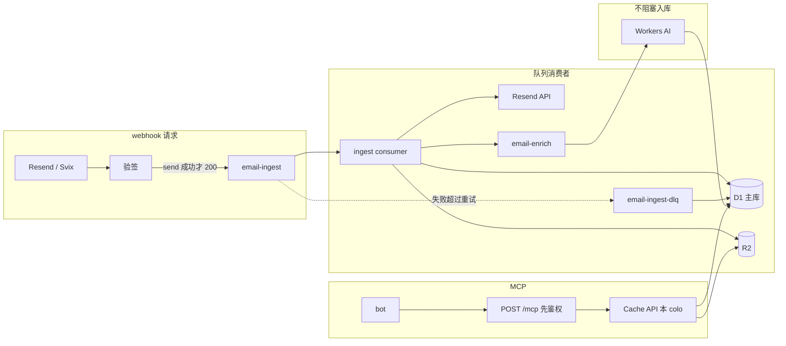

# P1 技术方案：把 Cloudflare 用满

状态：设计文档。不改 `wrangler.toml`、Worker 或迁移。下面所有配置和代码都是草案，只存在于本文。

核对日期：2026-09-28。额度以当天的官方文档为准，出处列在文末。P0 尚未落到本分支，凡是依赖 P0 实现的地方都收在 [待 P0 落定后校准](#待-p0-落定后校准)，正文用假设编号引用。

## 范围

P0 的链路保持不变：Resend `email.received` / `email.sent` → Worker 验 Svix 签名 → Receiving / Emails API 取全文 → D1（`emails` / `attachments` / `events`，`email_id` 唯一）→ R2 存 `.eml` 和附件 → `POST /mcp`（Bearer `MCP_TOKEN`）提供 `search_emails`、`get_email`、`list_emails`、`email_stats`。

P1 只在这条链路上加 Cloudflare 原生能力：

1. Queues 把 webhook 收成「验签 + 入队」
2. Cache API 挡住重复读
3. Workers AI 在入库之后补中文摘要和标签
4. D1 Sessions API 预留读副本，并给单库 500 MB 准备分库
5. Workers Logs + Analytics Engine 观测
6. 用免费额度把「什么时候才值得开 $5 Workers Paid」算成数字

明确不做：Vectorize（要 Paid，而且 P0 的搜索是 SQL）、Durable Objects（幂等已经有 D1 唯一约束，DO 按墙钟计费）、Workflows（免费档每天 3,000 step，步骤模型和本链路不匹配）、KV（免费档每天 1,000 次写，且最终一致，不适合做幂等锁，也不适合存正文）。外部队列、Redis、OpenAI、Datadog 同样不引入，理由写在每一节。



## 待 P0 落定后校准

| ID | 假设 | 落地时怎么改 |
| --- | --- | --- |
| A1 | P0 webhook 在同一次请求里验签、调 Resend、写 D1/R2，然后才返回。P1 从「验签成功」处切开。 | 若 P0 已经入队，第 1 节改成核对配置，不再新增队列。 |
| A2 | 表为 `emails`（`email_id` 主键）、`attachments`、`events`。正文列名（from / to / subject / text / html / received_at / direction）以 P0 迁移为准。 | 草案 SQL 里的列名逐一替换，不改状态机。 |
| A3 | `events` 未必有 Svix 事件 id 的唯一约束。 | 没有就加 `events.event_id TEXT UNIQUE`。这是「同一次投递」的幂等键；`emails.email_id` 是「同一封邮件」的幂等键，两级都要。 |
| A4 | webhook 体只有类型和 `email_id`，没有正文。`email.received` 走 Receiving API，`email.sent` 走 `GET /emails/:id`，不是同一个端点。 | consumer 按 `type` 分支。若 P0 已经包成一个函数，沿用那个函数。 |
| A5 | 附件下载 URL 会过期。 | 必须在 ingest consumer ack 之前下完。enrich 队列不许再去拉 Resend。 |
| A6 | MCP 是同一个 Worker 上的 `POST /mcp`，Bearer `MCP_TOKEN`，工具只有四个。P1 不新加工具。 | 缓存和读副本包在这四个工具内部。若 P0 把附件 base64 塞进 `get_email`，按第 2 节改成流式读取，避免一次 JSON 撑破 10 ms CPU。 |
| A7 | 不清楚 HTML 进了 D1 还是只进了 R2。 | 建议 HTML 和 `.eml` 只留在 R2，D1 只留纯文本摘录、摘要、标签。若 HTML 已经在 D1，500 MB 按「数月」而不是「数年」触发分库，并另做一次搬迁。 |
| A8 | 单用户、单邮箱，没有 tenant 列。 | 分库按年，不按用户。 |
| A9 | 绑定名暂用 `DB`、`MAIL_BUCKET`。 | 以 P0 的 wrangler 为准。 |
| A10 | 密钥已有 `RESEND_API_KEY`、Svix webhook secret、`MCP_TOKEN`。 | P1 不新增外部密钥。AI 和 Analytics Engine 用绑定。 |
| A11 | `email_stats` 的 SQL 未知。 | 若是对 `emails` 全表聚合，改成 `stats_daily`。这是行读配额的第一风险，优先于容量。 |
| A12 | 今天的幂等只保证「行不重复」，不保证「不会再次请求 Resend / 再次 PUT R2」。 | consumer 先认领行，再决定要不要打外部 API。 |
| A13 | R2 key 形状未知。 | 用不可变 key：`eml/{email_id}.eml`、`att/{email_id}/{attachment_id}`。key 里若有会变的段，第 2 节的长 TTL 不成立。 |
| A14 | 还没有 `summary`、`labels`、`ai_status`、`ingest_status`。 | 全部可空。AI 或解析失败不得回滚已经写入的邮件行。 |
| A15 | 免费档数字：CPU 10 ms/次，请求 10 万/天，Queue 1 万操作/天且保留 24 h，D1 单库 500 MB、账号 5 GB / 10 库、行读 500 万/天、行写 10 万/天，R2 10 GB-月 + Class A 100 万/月 + Class B 1000 万/月且流出为 0，Workers AI 1 万 neurons/天，Workers Logs 20 万事件/天保留 3 天，Analytics Engine 10 万点/天。 | 只改第 6 节的阈值，不改架构。 |

## 1. Queues：webhook 只验签、只入队

### 为什么用 Cloudflare Queues，不用 SQS / Redis / 再开一个任务服务

webhook 和消费者是同一个 Worker、同一组绑定，入队是进程内的 `queue.send()`，没有第二套凭证，也没有出网。免费档每天 1 万次操作（2026-02-04 起 Queues 进入 Workers Free），个人邮箱用不满。死信、重试、积压都在同一块仪表盘上。

SQS 或 Redis 会把「已经在 Cloudflare 上的一次投递」再送出网络，还要单独做鉴权、死信和幂等。Workers 本身不出网免费，但对方会计费，故障域也变成两个。这个量级撑不起那份复杂度。

不用 Workflows 或 Durable Objects 来编排同一步：入库是「至少一次的后台作业」，不是多步长事务。队列就是这个模型。

### 行为

1. 读原始 body，验 Svix 签名。失败返回 401，不入队。Svix 对非 2xx 仍会重试，但重试停在验签，不产生队列消息。
2. 签名通过后，往 `email-ingest` 放一条小消息（1 KB 内）：`event_id`（Svix id）、`type`、`email_id`、`created_at`。不放正文。
3. `send()` resolve 之后立刻返回 200。`send()` 之前或当时失败，返回 500，让 Svix 以后再试。200 之后 Worker 里不得再做 Resend、D1、R2。
4. consumer 拉 Resend、写 R2、写 D1，成功则 `ack()`。可重试错误调用 `message.retry({ delaySeconds })`。不可重试错误直接 `ack()` 并在 `events` 记下原因，避免把配额烧在必定失败的重试上。
5. 超过 `max_retries` 进 `email-ingest-dlq`。死信 consumer 把载荷和错误写入 D1 后 `ack()`。死信队列不再挂自己的死信队列。

免费档消息保留 24 小时，且不能改长。官方对「没有 consumer 的死信」另有 4 天的说法，和免费档 24 小时冲突。处理办法是死信必须有 consumer，失败记录落在 D1，不把队列当档案。

Resend 侧的正文保留期通常长于队列，但不是我们能控制的 SLA。consumer 要在 ack 前把 `.eml` 和附件放进 R2。R2 写完之后，Resend 不再是数据源。

### 草案：wrangler 片段

绑定名见 A9。`max_batch_size = 1` 是故意的：免费档 10 ms CPU 是按一次调用算的，一批 10 封会共享这 10 ms。付费档再把 ingest 的 batch 调到 10。

```toml
# 草案，不要抄进仓库里的 wrangler.toml，等 P0 绑定名落地后合并

[[queues.producers]]
binding = "INGEST_QUEUE"
queue = "email-ingest"

[[queues.producers]]
binding = "ENRICH_QUEUE"
queue = "email-enrich"

[[queues.consumers]]
queue = "email-ingest"
max_batch_size = 1
max_batch_timeout = 1
max_retries = 5
max_concurrency = 2
dead_letter_queue = "email-ingest-dlq"

[[queues.consumers]]
queue = "email-ingest-dlq"
max_batch_size = 1
max_retries = 3
max_concurrency = 1

[[queues.consumers]]
queue = "email-enrich"
max_batch_size = 1
max_batch_timeout = 5
max_retries = 2
max_concurrency = 1
dead_letter_queue = "email-enrich-dlq"

[[queues.consumers]]
queue = "email-enrich-dlq"
max_batch_size = 1
max_retries = 2
max_concurrency = 1
```

`max_concurrency = 2` 把 Resend 的 429 挡在队列侧。默认并发会扩到平台上限，一封邮件的 429 会变成一串并发重试。收到 429 时用响应里的 `Retry-After`（没有就 60 秒）调用 `message.retry({ delaySeconds })`，不在消费者里 `sleep` 空转。

`email-enrich` 与入库分开，见第 3 节。AI 失败不许把已经写好的邮件重新送回 Resend。

### 消费者幂等

Queues 是至少一次，Svix 也是至少一次。重复来自：Svix 没看见 200 又投了一次、consumer 在 `ack` 前崩溃、手工 replay。

幂等分两级：

- `events.event_id`（Svix id）唯一：同一次 webhook 的重放插不进第二行（A3）。
- `emails.email_id` 唯一：同一封邮件只留一行（P0 已有）。

ingest 处理顺序：

1. 用主库，不用读副本。`INSERT INTO events (event_id, email_id, type, ...) VALUES (...) ON CONFLICT(event_id) DO NOTHING`。
2. `INSERT INTO emails (email_id, ingest_status, ...) VALUES (?, 'processing', ...) ON CONFLICT(email_id) DO NOTHING`。
3. 若 `email_id` 冲突：读主库上的现有行。`ingest_status = 'complete'` 且 R2 对象都在，则 `ack()`，不再请求 Resend。`processing` 且 `updated_at` 在 10 分钟内，说明另一个调用还在跑，`retry({ delaySeconds: 30 })`。超过 10 分钟则接管。
4. 只有认领成功或接管成功才调 Resend。先 `head` R2，没有对象再 `put`。覆盖写功能上安全，但会多计一次 Class A。
5. 附件插 `ON CONFLICT DO NOTHING`。全部对象落定后把 `ingest_status` 更新为 `complete`，再往 `email-enrich` 投一条 `{ email_id }`（同样可以重复投，enrich 自己会短路）。
6. `ack()`。

不可重试、应直接 ack 并记 `events.error`：Resend 404（邮件已不在）、401/403（密钥错了，重试不会好）、载荷缺 `email_id`。

可重试：Resend 429、Resend 5xx、D1/R2 临时错误、调用被 CPU 限制杀掉（平台会自己重投，应用代码看不到异常）。

`email.sent` 和 `email.received` 的 `email_id` 不是同一空间时，行不会撞；若 P0 发现两者可能同 id，唯一键改成 `(email_id, direction)`，本状态机不变。

### Resend 重试风暴

Resend 的自动重试日程（失败后顺延）：立即、5 秒、5 分钟、30 分钟、2 小时、5 小时、10 小时、再 10 小时。约 8 次，跨 28 小时左右。手工 replay 还会在此之外再来一次。任何非 2xx 都算失败，包括 401。

队列侧：成功投递约 3 次操作（写、读、删）。每重试一次多 1 次读。消息小于 64 KB（我们远小于此），不按块翻倍。死信再加 1 次写。

| 场景 | Svix 打到 Worker 的次数 | 入队条数 | 队列操作，大约 | 打到 Resend API |
| --- | --- | --- | --- | --- |
| 正常，`send()` 后 200 | 1 | 1 | 3 | 1 |
| Worker 挂了或在 `send()` 前 500，持续约 2 小时 | 4（立即、5 秒、5 分、30 分） | 0 | 0 | 0 |
| 错误实现：入队之后还在 webhook 里做入库，入库失败仍返回 500 | 约 6（12 小时内） | 6 | 18，再乘 consumer 重试 | 若 consumer 不短路，最多 6 × (1 + 重试次数) |
| P1：200 只代表入队；consumer 遇 429 重试 2 次后成功 | 1 | 1 | 3 + 2 次读 | 3 次调用，1 次成功 |
| 已成功的事件被手工 replay | +1 | +1 | +3 | 0，第 3 步短路 |

风暴要防的是第三行。防护就三条：

- webhook 在 `send()` 成功后没有别的工作，成功就 200。Svix 的指数退避只覆盖「我们没接住」的窗口，不会和 consumer 的重试叠乘。
- 重复消息在请求 Resend 之前短路。重放的成本是几次 D1 点查和 R2 `head`，不是又一次把正文拉下来。
- `max_retries = 5`、`max_concurrency = 2`、429 按 `Retry-After` 推迟。不要用默认的「失败立刻再投 + 并发拉满」。

数量级：200 封邮件若走了第三行（平均 4 次 Svix 重试，consumer 又把 5 次重试用完再进死信），操作数大约 `200 × 4 × 7 ≈ 5,600`，再加死信 consumer，有机会在一天内靠近 1 万操作的免费顶。同样 200 封走 P1 的正确路径，即使其中一半 429 重试两次，也是 `200 × (3 + 1) ≈ 800` 次操作。所以「会不会被 Resend 打爆」取决于 200 的时机，不取决于要不要用队列。

鉴权失败保持 401，不要为了消重试改成 200。那几次重试没有入队，便宜，而且 200 会把伪造请求记成成功。

## 2. 边缘缓存

### 为什么用 Cache API，不用 Redis / KV / 在前面套一层 CDN

要挡的是「同一个 bot 在短时间里把同一封邮件或同一份统计再读一次」，不是全球分发。`caches.default` 就在处理这次请求的 colo 里，命中后不再打 D1 和 R2，没有单独的产品费。

KV 免费档每天 10 万次读、1,000 次写，写配额比队列还紧，而且是最终一致的，不适合当刚入库邮件的缓存。Redis 要出网、要运维。CDN 缓存规则不能用在 `POST /mcp` 上：缓存在 Worker 之前就会跳过 Bearer 鉴权。`/mcp` 的响应不要带可被边缘缓存的 `Cache-Control: public`。

缓存放在鉴权之后，用 Worker 自己构造的 GET 键，客户端决定不了键。

### 零流出用在哪里

R2 流出为 0，Workers 响应带宽也不计费。和 S3 相比，差的就是这一项：bot 反复把一封 5 MB 的附件拉走，在 R2 上只有 Class B 次数，没有按 GB 的流出账单。100 GB/月的重复下载，S3 流出大约是 9 美元量级，这里是 0。

因此不需要为了省钱做「外链签名 URL 绕开 Worker」或「正文只留摘录、逼 bot 去别处下」。字节可以经 Worker 流出。要控制的是 Worker 内存（128 MB）和免费档 10 ms CPU，不是流量费：

- `.eml` 和附件以对象存在 R2，MCP 默认不把它们 base64 进 JSON。
- `get_email` 返回元数据、纯文本摘录、摘要、标签、R2 key。
- 二进制用鉴权之后的流式读取（`R2Object.body` 直接作为 `Response` body），不在 Worker 里拼成一个大字符串。若 P0 只有 MCP、没有 HTTP 读取路由（A6），就在 `get_email` 里对小附件（例如 ≤ 256 KB）内联，更大的只给 key 和大小，读取路由作为 P0 校准后的增量。不要为了协议整齐把 10 MB 附件编码进 JSON。

个人量级下，缓存省下的钱接近 0：Class B 免费额度是每月 1,000 万次，D1 行读是每天 500 万。缓存的收益是延迟，以及别让 `email_stats` 的全表扫描把行读配额打穿（见第 4、6 节）。零流出解决的是「敢不敢把原文存下来并交给任意 bot」，缓存解决的是「同一份东西别反复解析」。

Cache API 是按 colo 的，不是全球一条缓存。bot 若固定从一个区域来，`get_email` 的重复读命中率会高；bot 散落多地，命中率会低，这不是故障。不要为了抬命中率去买 Cache Reserve。

### 哪些可以缓存

邮件正文和附件是不可变的（A13）。摘要会从「还没有」变成「有了」，所以元数据的缓存键要带上 `ai_status`。

| 数据 | 是否缓存 | TTL | 键 | 失效 |
| --- | --- | --- | --- | --- |
| `get_email`，且 `ai_status` 已是 `ok` / `failed` / `skipped` / `deferred` | 缓存 | 24 h | `GET https://cache.internal/mcp/get?id={email_id}&ai={status}` | 键里已有状态。摘要写上之后键变了，旧条目等 TTL。`pending` 和 `null` 不缓存，避免把「还没摘要」钉住 24 小时 |
| R2 上的 `.eml`、附件 | 缓存 | 7 天 | `GET https://cache.internal/r2/{key}` | 对象不可变，不主动删。Cache API 单对象上限之内（邮件附件远小于此） |
| `search_emails` | 只挡同一次对话里的重复调用 | 10 s | 规范化查询的哈希（排序后的参数，不含 token） | 只靠 TTL。邮箱是追加写的，长 TTL 会让 bot 看不见刚到的信 |
| `list_emails` | 同上 | 10 s | 过滤器 + cursor 的哈希 | 同上 |
| `email_stats` 的日汇总 | 缓存 | 120 s | `stats:{day}` | TTL。计数在入库时加，不依赖 AI |
| 按标签的分布 | 缓存 | 120 s | `stats:labels:{day}` | 允许落后于 enrich。文档里写明，bot 不要把它当实时值 |
| webhook、队列消费、任何 401 | 不缓存 | — | — | — |

`search` / `list` 的查询词来自模型时，分布很散，命中率可能接近 0。这是预期，不要把 TTL 加到几分钟去「做高命中率」。真正值得长 TTL 的是按 id 取信和 R2 对象。

查询带 `fresh: true`（若 P0 工具参数里还没有这个字段，校准 A6 时加上）时绕过缓存。刚入库就来取的 `get_email` 也会因为 `ai_status` 仍为空而走主库，不会读到副本上或缓存里的旧「不存在」。

草案，鉴权之后：

```js
// 草案。只说明键和 TTL，不是要提交的实现。
async function cachedGet(env, ctx, emailId, aiStatus) {
  const cache = caches.default;
  const key = new Request(
    `https://cache.internal/mcp/get?id=${encodeURIComponent(emailId)}&ai=${aiStatus}`
  );
  const hit = await cache.match(key);
  if (hit) return { response: hit, hit: true };
  const response = await loadEmailFromD1(env, emailId); // 见第 4 节的 session
  ctx.waitUntil(cache.put(key, response.clone()));
  return { response, hit: false };
}
```

`cache.put` 的响应用 200，并带上私有的 `Cache-Control: max-age=...`。不要把这枚响应原样透传成可以被 CDN 缓存的 MCP 响应。

## 3. Workers AI：入库后打标签、写中文摘要

### 为什么用 Workers AI，不用外部模型 API

正文不出 Cloudflare。没有第二把 API key，调用是绑定的 `env.AI.run`。免费档每天 1 万 neurons，用尽的行为是当天失败，而不是默默扣钱。失败时降级路径就是「这封邮件没有摘要」，MCP 四个工具照常返回。

外部模型要把信件正文送到别人的 GPU 上，隐私和故障域都更差。这个功能是附加的，不值得为它单独买一个模型账号。

不用推理模型（QwQ、带 thinking 的大模型、文档标明要 Paid 或预付费的 Kimi / GLM / DeepSeek V4）。摘要是短 JSON，推理 token 会把 1 万 neurons 提前烧完。

### 模型

主模型：`@cf/qwen/qwen3-30b-a3b-fp8`。

- 中文是训练语言之一，3B 激活参数的 MoE，适合「摘录 + 闭集标签」，不必上 32B/70B。
- 标价与 `@cf/meta/llama-3.2-3b-instruct` 同一档：输入 4,625 neurons / 百万 token，输出 30,475 neurons / 百万 token（约 $0.051 / $0.335 per M tokens）。
- Qwen3 默认可能产出 thinking。调用时必须关掉 thinking（`enable_thinking: false` 或等价参数），并把 `max_tokens` 限制在 320。若绑定不支持关闭 thinking，改用备选，不要带着思维链跑。

备选：`@cf/meta/llama-3.1-8b-instruct-fp8-fast`（输入 4,119、输出 34,868 neurons / 百万 token）。中文弱于 Qwen3，但没有思维链这一项不确定因素。`llama-3.2-1b` 更便宜，中文摘要质量不够，不用。

闭集标签：`通知`、`账单`、`验证码`、`往来`、`订阅`、`广告`、`工作`、`旅行`、`其他`。模型只输出 JSON：`{"summary":"...","labels":["账单"]}`。摘要不超过 80 个汉字。解析失败或标签不在闭集里，记 `ai_status = failed`，不把原文写进标签列。

输入只带：from、to、subject、纯文本摘录。摘录截到约 1,200 个汉字。有 Resend 的 text 字段就用 text，不要在消费者里对一整封 HTML 做正则去标签（这是 10 ms CPU 最容易被打穿的地方）。只有 HTML 时，先截到 4,000 字符再去掉标签，仍然只发生在 enrich consumer 里。

按 Qwen 中文大约 1.5 字一个 token 估算（落地后用响应里的 usage 替换这个估算）：

| 部分 | token | neurons |
| --- | --- | --- |
| 输入：提示约 300 + 正文约 800 | 1,100 | 1,100 / 1e6 × 4625 ≈ 5.1 |
| 输出：上限 320，正常约 200 | 200 | 200 / 1e6 × 30475 ≈ 6.1 |
| 每封合计 | | **约 11** |

1 万 neurons / 11 ≈ **每天约 900 封**仍在免费额度内。个人邮箱按 50 封/天（收+发）大约用掉 550 neurons，占额度 6%。不截断、把 8,000 token 的 HTML 全送进去时，一封会到 40 neurons 以上，额度大约只够 250 封/天，所以截断是额度策略的一部分，不是可选项。

这些是规划数字。真正入账以 Workers AI 返回的 token 为准，记到 Analytics Engine（第 5 节），不记正文。

### 不阻塞入库

AI 不在 webhook 里，也不在 ingest consumer 的同一次调用里。ingest 把 `ingest_status` 写成 `complete` 并 `ack` 之后，另投 `email-enrich`。

这样拆的原因：

- Workers AI 的墙钟经常是数秒。放在 ingest 里会拖住 ack，崩溃后又把 Resend 拉取重做一遍。
- AI 配额用尽、模型超时、JSON 不合格，都不应该让邮件消失或进 ingest 死信。
- 多出来的成本是每封大约 3 次队列操作。50 封/天就是 150 次，相对每天 1 万的额度可以忽略。

enrich 短路：主库上 `ai_status = 'ok'` 则直接 ack。`max_concurrency = 1`，重复消息是串行的，第二次会看见 `ok`。崩溃发生在模型已成功、写库之前时，重试会再调用一次模型；个人量级接受这一种重复，不为它做分布式锁。

降级：

| 失败 | `ai_status` | 要不要重试 |
| --- | --- | --- |
| 模型 5xx、网络超时 | `failed` | 用队列重试，最多 2 次，然后进 enrich 死信。死信只记账，不阻塞读取 |
| 输出不是合法 JSON，或标签越界 | `failed` | 不重试。同样的提示词再跑一次，大概率还是坏的 |
| 当天 neurons 用尽 | `deferred` | 不重试。次日 01:20 UTC 的 cron 再投递（额度 00:00 UTC 重置）。cron 只挑选 `deferred`，每天一条队列消息一封，不要在午夜打出并发 |
| 正文空、只有附件 | `skipped` | 不调用模型 |

MCP 在摘要缺失时返回邮件的其余字段。`search_emails` 不把「有摘要」当过滤条件，除非调用方明确要标签。

额度用尽不会在免费档产生账单，调用直接失败。要在同一天继续打标签，才需要 Workers Paid；超出的部分是 $0.011 / 1,000 neurons。按每封 11 neurons，多出来的 1,000 封大约是 $0.12。真正的门槛是每月 5 美元的套餐，不是 neurons 单价。个人邮箱不值得为了「第 901 封也要当天有摘要」去开套餐；`deferred` 到次日即可。

### CPU

等模型返回的时间不算 CPU。enrich 调用里算 CPU 的是截断文本、解析 JSON、更新一行。这应当远小于入库那次对大 JSON 的 `JSON.parse`。AI 因此不是逼你开 Paid 的原因；大正文解析才是（第 6 节）。

## 4. D1 读扩展

### 为什么继续用 D1，不开外置数据库，也不为了读扩展去分库

主库在免费档已经是一个单线程的 Durable Object：个人邮箱的写入每秒远小于 1，读和写互相挡住的情况不会先出现。D1 读副本不另收存储费和计算费，行读行写照旧。Sessions API 让「先把代码写成可路由、以后再在仪表盘打开副本」成为一次配置，而不是一次迁移。

PlanetScale、带只读副本的 Postgres，解决的是连接数和跨区读。这里没有连接池问题（Worker 绑定没有握手），跨区读等度量数据出现再开副本即可。把数据搬出去会失去 Time Travel（免费档 7 天、付费档 30 天）和「行读行写」这种可预期的账单。

分库解决的是单库 500 MB 硬顶，不是 QPS。不要为了读扩展提前分库。

### 现在的官方限额（容易和「5 GB」混在一起）

| | Workers Free | Workers Paid |
| --- | --- | --- |
| 单库硬顶 | **500 MB** | **10 GB**（不能再提高） |
| 账号存储 | 5 GB | 含 5 GB，超出 $0.75 / GB-月；账号硬顶 1 TB |
| 库数量 | 10 | 50,000 |
| 行读 | 500 万 / 天 | 每月含 250 亿，超出 $0.001 / 百万行 |
| 行写 | 10 万 / 天 | 每月含 5,000 万，超出 $1.00 / 百万行 |

读副本不增加 500 MB，也不把行再算一份钱。

### 什么时候开读副本

默认不开。同时满足下面两条再开：

- MCP 的读者和主库不在同一区域，或者索引查询的 p95 超过 150 ms；
- 这段延迟出现时，ingest 的积压也在涨（主库上的读把写堵住了）。

只满足第一条时，先确认是不是缺索引（缺索引会放大行读和延迟）。索引够用、bot 又和主库同区，副本没有收益。

代码从第一天就走 Sessions API，打开副本时不用改查询：

| 调用方 | session | 原因 |
| --- | --- | --- |
| ingest、enrich、死信、幂等判断 | 直接用绑定，或 `withSession("first-primary")` | 必须读到自己刚写的行。副本为空时会把「已入库」误判成「要再拉一次 Resend」 |
| `get_email` | 调用方若带上一次返回的 bookmark，用 bookmark；否则 `first-primary` | 刚入库的读取不能落在还没跟上的副本上 |
| `search_emails`、`list_emails`、`email_stats` | `withSession("first-unconstrained")` | 允许落后几秒。列表本来就有 10–120 秒缓存 |

工具结果里带上 `session.getBookmark()`，放在 MCP 结果的元数据里（字段名等 P0 的响应信封定，A6）。bot 链式调用时把 bookmark 送回来，同一次对话里的读是顺序一致的。

写始终进主库，即使 session 是 unconstrained。ingest 不要用 unconstrained 去做「有没有这行」的判断。

不为 MCP Worker 开 Smart Placement。Placement 会把请求拉到主库附近，读副本的就近就没有了。

### 行读怎么才不会先被 stats 打穿

`email_stats` 如果对 `emails` 做全表 `COUNT` / `GROUP BY`，调用次数 × 行数就是行读。库里有 5 万行、每分钟一次统计：`1440 × 50,000 = 7,200 万` 行读/天，免费档 500 万的顶在容量还早的时候就会到。

入库成功的那一次（不是重放短路的那一次）对当天行做一次递增：

```sql
-- 草案
CREATE TABLE stats_daily (
  day TEXT PRIMARY KEY,              -- UTC YYYY-MM-DD
  received INTEGER NOT NULL DEFAULT 0,
  sent INTEGER NOT NULL DEFAULT 0,
  with_attachments INTEGER NOT NULL DEFAULT 0
);
```

`email_stats` 读这张表，再叠加 120 秒缓存。标签分布单独查，并且只扫描「有标签且在时间窗内」的行，要求 `ai_status` 与 `received_at` 上有能用的索引；没有这张时间窗就不要提供「全历史标签分布」。

二次索引会让写入行数变多（行本身一行，索引一行）。摘要和标签列不要建索引，除非真的按标签过滤。按标签过滤用生成列或单独的 `email_labels(email_id, label)`，并且只在查询证明需要之后再加。

`search_emails` 的过滤列（`received_at`、发件人、主题如需）在 P0 落地后对照真实 SQL 补索引。无索引的 `LIKE '%词%'` 会扫全表，既慢又贵，不靠副本来解决。

### 500 MB 增长预案

先把 HTML / `.eml` 留在 R2（A7）。这是免费档能多活很久的原因，比分库便宜。

粗算，50 封/天：

| D1 里每封留下的东西 | 单行大约 | 写满 500 MB | 50 封/天能撑 |
| --- | --- | --- | --- |
| 元数据 + 2 KB 纯文本摘录 + 摘要 | 3 KB | 约 17 万封 | 约 9 年 |
| 上面这些，再加平均 50 KB HTML | 50 KB | 约 1 万封 | 约 200 天 |

附件不进这个表。R2 的 10 GB 是另一条曲线，按每天 50 封：

| 平均每封（含 `.eml` 和附件） | 年增量 | 写满免费 10 GB |
| --- | --- | --- |
| 100 KB（通知为主，附件很小） | 约 1.8 GB | 约 5 年 |
| 0.7 MB | 约 13 GB | 约 9 个月 |
| 3 MB（照片） | 约 55 GB | 约 2 个月 |

这是 R2 价目，不是 Workers Paid 的开关，见第 6 节。附件一大，R2 会比 D1 的 500 MB 更早碰到免费顶。

免费档的分库，触发条件用「预计 30 天内越过 400 MB」，不要等到插入失败。

- 按年一库：`emails-2026`、`emails-2027`。单用户不按邮箱拆（A8）。
- 另有一个目录库 `emails-dir`：`email_id → shard`。`get_email` 先查目录再查年库。目录行只有 id，20 万封也是几 MB 到十几 MB，不会先满。
- 免费档 10 个库的预算：1 个目录 + 9 个年库。年和 500 MB 同时写满时，账号 5 GB 也到了，这就是免费档的终点。
- 写入进 `received_at` 所在年的库，不用 Worker 的当前时钟，避免跨年夜分错。唯一约束在年库内部；跨年边界的重放若插错库，目录冲突能看出来，再查相邻年。
- `search` / `list` 默认只查当年和上一年。每多查一个库就是一次子请求，免费档每次调用最多 50 次子请求，不要对 9 个库扇出。更老的年份要调用方显式给 `year`。
- 轮转到新库时，把旧库的 `stats_daily` 合计冻结进目录库的 `stats_archive`。`email_stats` 读「归档合计 + 当前库」，不跨库扫邮件行。
- 超过两年的库不再接收写入。回填和 replay 若带着旧的 `received_at`，仍然写回那一年；「只读」指的是 MCP 不触发 enrich 之外的新业务，不是把绑定改成只读账号。

付费档的另一条路更简单：单库硬顶变成 10 GB，个人量级在「D1 只留摘录」的前提下到不了，就不要分库。分库是为了留在免费档。一旦决定开 $5，保持单库，把已经拆出去的年库当作以后真的越过 8 GB 再做的事。10 GB 仍是硬顶，付费也不提供「把这一库调到 50 GB」。

Time Travel 用来挽回错误的 `UPDATE` / `DELETE`（免费 7 天）。它不覆盖 R2 里的对象，也不替代死信表。

## 5. 可观测性

### 为什么用 Workers Logs 和 Analytics Engine，不用 Datadog / Axiom

个人量级的日志量是每天几百到几千条，落在免费档 20 万事件/天、保留 3 天里面。Analytics Engine 免费档每天 10 万个数据点、1 万次读，而且 `writeDataPoint` 不计额外延迟。队列积压、Worker 错误率、D1 存储在仪表盘上已经有，不必再采集一遍。

外部 APM 要把日志推出去。Logpush 只在 Workers Paid 上提供，推出去的内容还会碰到邮件元数据。先把「不记录正文」做死，再谈要不要更长的保留期。付费档日志是每月含 2,000 万事件、超出 $0.60 / 百万，保留 7 天；个人量级开了套餐也不会在日志上产生超额。

### 记什么

平台已经有的，不重复造：

- Worker：请求数、错误率、CPU 时间、墙钟。CPU p99 是第 6 节里决定要不要开 Paid 的指标。
- Queues：积压（backlog）和消费延迟。深度以这个为准，不要用 cron 去 `list` 队列。
- D1：存储字节、行读、行写。400 MB 预警看这个图。
- Workers AI：neurons。用它核对第 3 节的估算。

Workers Logs 打开，并且每条调用只打一条结构化日志。不打正文、摘录、摘要、主题、地址、token、签名。

```toml
# 草案
[observability]
enabled = true
head_sampling_rate = 1
```

采样在个人量级保持 1。MCP 请求超过每天 2 万次时，把读请求的 `head_sampling_rate` 降到 0.1，ingest / enrich / 死信保持全量。按调用采样，不要按「每条 SQL」打日志。

Analytics Engine 记业务量，一个调用一个点：

| 数据集字段 | 含义 |
| --- | --- |
| blob `stage` | `webhook`、`ingest`、`enrich`、`dlq`、`mcp` |
| blob `outcome` | `ok`、`duplicate`、`retry`、`dlq`、`unauthorized` |
| blob `tool` | MCP 工具名，其它阶段为空 |
| double `lag_ms` | ingest：`now - 邮件 created_at`。只在入库完成时有意义 |
| double `wall_ms` | 本次调用墙钟 |
| double `cache` | `1` 命中，`0` 未命中，非读路径不写 |
| double `neurons` | enrich 从模型 usage 换算的估算，没有 usage 就写 0 |

`email_id` 可以进 Workers Logs（3 天，用来把死信和邮件对上），不要进 Analytics Engine 的高基数索引。Analytics Engine 的 index 用 `stage` 这种低基数。

草案：

```toml
[[analytics_engine_datasets]]
binding = "METRICS"
dataset = "mail_metrics"
```

### 告警

免费档没有「自定义指标超过阈值就呼叫」的原生告警。分成两层：

1. 仪表盘通知（零代码）：Worker 错误率升高、脚本抛错。队列积压和 D1 存储每天看一次图即可，个人邮箱不需要值班。
2. 已有的每日 cron（01:20 UTC，和第 3 节的 `deferred` 重试是同一个，免费档 cron 一共只有 5 个名额）查 D1：`stats_daily`、`ai_status` 计数、死信表行数、以及用 D1 `meta` 或存储读数能拿到的库大小。越界才用已经存在的 Resend 密钥给自己发一封邮件。不要为了告警再接一个监控 SaaS，也不要在 Worker 里放 Cloudflare API token 去查 Analytics Engine SQL。Analytics Engine 留给事后排查。

阈值：

| 信号 | 阈值 | 级别 | 说明 |
| --- | --- | --- | --- |
| webhook 5xx | 15 分钟内 > 1% | 立刻看 | 说明 200 没发出去，Svix 风暴开始了 |
| ingest 失败后进入重试的比例 | 15 分钟内 > 5% | 立刻看 | Resend 或 D1 在失败 |
| 死信表新增 | 任何一天 > 0 | 当天处理 | 免费档队列 24 小时会过期，所以死信必须已经落表；告警的是表，不是队列深度 |
| ingest `lag_ms` p95 | > 60 秒，持续 15 分钟 | 当天处理 | 个人邮箱正常是秒级。队列积压图应同时上升 |
| 队列积压 | > 100，或连续 10 分钟上升 | 当天处理 | 用 Queues 自带图 |
| CPU p99 | > 8 ms | 开 Paid 的判据 | 免费档硬顶 10 ms。这是容量信号，不是故障 |
| `get_email` 缓存命中率 | 预热后连续 7 天 < 30% | 只记录 | bot 分散或键设计错了。不呼叫 |
| enrich `failed` + `deferred` | 1 小时内 > 20% 的入库量 | 当天处理 | 读取仍正常。看是不是 neurons 用尽 |
| 当日 neurons 估算 | > 8,000 | 当天处理 | 接近 1 万。确认截断还在 |
| 单库体积 | > 400 MB | 30 天内做分库或开 Paid | 第 4 节 |
| R2 存储 | > 8 GB | 计划附件保留策略 | 不强制 Workers Paid |
| Worker 请求 | > 8 万/天 | 看是哪个 bot 在轮询 | 硬顶 10 万 |
| 队列操作 | > 8,000/天 | 看重试是不是叠乘了 | 硬顶 1 万 |

命中率的算法：MCP 读路径上 Analytics Engine 的 `cache` 字段，按天 `sum(cache) / count()`。分母含故意绕过缓存的 `fresh: true`，所以解读时把 `fresh` 单独计成 outcome，不要算进命中率。

## 6. 成本模型

### 为什么这套账可以停在免费档

P0 和 P1 用到的请求、SQL、对象、模型和日志都在同一个 Workers 账号的免费包含量里，而且没有流出一项。外部替代会把「接近 0」拆成几张按量和按主机的账单，同时把信件正文送出去。$5 Workers Paid 是整账号的地板价：要么 0，要么至少 5。中间不存在「只给队列付 0.4 美元」的档。所以决策是一个开关，开关的条件必须是某个免费硬顶，而不是「感觉该上付费了」。

下面的「个人基线」：每天 40 封收到 + 10 封发出，平均 1.2 个附件，MCP 每天 `search` 200、`get` 100、`list` 50、`stats` 20，共 370 次读。双队列，无重试。D1 只存摘录（A7 的建议路径）。

| 维度 | 免费硬顶 | 基线每天占用 | 占用比例 | 越过之后 |
| --- | --- | --- | --- | --- |
| Worker 请求 | 10 万/天 | webhook 50 + ingest 50 + enrich 50 + MCP 370 ≈ **520** | 0.5% | Error 1027。webhook 开始 5xx，Svix 重试 |
| CPU | 10 ms/次 | 与封数无关，见下文 | — | Error 1102，队列自动重试，可能把操作数打满 |
| 队列操作 | 1 万/天 | 50 封 × 2 条消息 × 3 操作 = **300** | 3% | `send()` 失败，只能 500，Svix 接上 |
| D1 行写 | 10 万/天 | 每封约 8–15（行 + 附件 + event + 有限索引），取 12 × 50 = **600** | 0.6% | 写入失败，consumer 重试 |
| D1 行读 | 500 万/天 | 入库点查约 250；MCP 若走索引和 `stats_daily`，约 1–2 万 | < 1% | 读失败。全表 stats 会提前打穿，见下 |
| D1 单库 | 500 MB | 摘录路径约 150 KB/天 | 数年 | 不能再写入该库 |
| D1 账号 | 5 GB 且最多 10 库 | 同上 | — | 分库方案的终点 |
| R2 存储 | 10 GB-月 | 100 KB/封 ≈ 1.8 GB/年；0.7 MB/封 ≈ 13 GB/年；3 MB/封 ≈ 55 GB/年 | 附件一大就会在第一年碰到 | 超额走 R2 价目 $0.015/GB-月，**不必**为此开 Workers Paid |
| R2 Class A | 100 万/月 | 50 × 2.2 次 PUT × 30 ≈ **3,300**/月 | 0.3% | $4.50 / 百万，同样不单独迫使开 Workers 套餐 |
| R2 Class B | 1,000 万/月 | 即使每次 `get_email` 都读对象，100 × 30 = 3,000 | ≈ 0 | $0.36 / 百万 |
| Workers AI | 1 万 neurons/天 | 50 × 11 ≈ **550** | 6% | 免费档直接失败，不扣钱。同一天继续跑才需要 Paid |
| Workers Logs | 20 万事件/天，留 3 天 | 每调用 1 条 ≈ **520** | 0.3% | 超额要 Paid；$0.60 / 百万 |
| Analytics Engine | 10 万点/天 | 每调用 1 点 ≈ **520** | 0.5% | 文档写明尚未按价计费；免费包含量仍按 10 万/天设计，不把「现在不收费」当成可以无界打点 |

子请求：免费档每次调用 50 个。一封邮件的 ingest 是 1 次 Resend 元数据 + 若干附件 + 若干 R2 + 若干 D1，正常小于 15。附件并发不要超过 4（同时出站连接的平台限制是 6）。

### 什么量级才要开每月 5 美元

Workers Paid 的地板是 $5/月，包含大约：1,000 万请求/月、3,000 万 CPU-ms/月、100 万次队列操作/月、D1 每月 250 亿行读和 5,000 万行写、单库 10 GB、日志 2,000 万事件/月。个人基线开了套餐之后，超额仍是 $0，账单就是这 5 美元。CPU 按每封 50 ms、每天 1,000 封计算，一个月也只有约 450 万 CPU-ms，到不了 3,000 万的包含量。

按「会先撞上的顺序」：

1. **单次 CPU p99 > 8 ms，与每天多少封无关。** 免费档硬顶 10 ms，只计算 JS，不算等待 Resend / D1 / R2 / AI 的时间。webhook 只验签加 `send()`，应当在 2–4 ms。风险在 ingest 对大正文做 `JSON.parse`、把附件 base64 进字符串、或用正则剥一整封 HTML。一封几 MB 的订阅邮件就可能越过 10 ms，然后队列重试，重试用尽进死信。判据是上线时用一封大的真实订阅邮件看 Workers Logs 里的 CPU，而不是等日请求数涨上来。越过之后的正确动作是开 Workers Paid，并把该 Worker 的 `cpu_ms` 上限写成 50–100，避免失控脚本吃包含量。不要为了躲这 10 ms 去加外部解析服务，也不要幻想再拆一条队列就能把同一次 `JSON.parse` 变便宜：解析那一下总要落在某一次调用里。
2. **队列操作每天超过约 1,600 封「双队列、无重试」的邮件，或更早的失败叠乘。** 1 万操作 / 每封 6 操作 ≈ 1,600 封/天。第 1 节算过：错误地把入库留在 webhook 里时，大约 200 封失败邮件就能靠近这个顶。健康路径下，个人邮箱到不了。
3. **Worker 请求每天超过 8 万。** 硬顶 10 万。基线 520 的 150 倍以上，或者一个 bot 以每秒 1 次的速度轮询（86,400 次/天）再叠加其它调用。先给 bot 加缓存和退让，再考虑付费。
4. **单库预计 30 天内超过 400 MB，并且不想按年分库。** 摘录路径是数年；HTML 若存在 D1（A7），大约半年量级。开 Paid 把单库硬顶抬到 10 GB，比分库简单。想继续 0 美元就走第 4 节的年库，不要两者一起做。
5. **同一天需要给大约 900 封以上的邮件打标签。** 不到这个数，`deferred` 拖到次日即可，账单保持 0。超过之后若坚持当天完成，才为 AI 开 Paid；多出来的 neurons 很便宜，贵的是地板价。
6. **D1 行写约 8,000 封/天**（按每封 12 行写）。行读在有索引且 stats 走汇总表时，要到非常大的搜索量才满 500 万；无索引或全表 stats 时，几万行的库加上每分钟一次统计就会满。那是查询形状问题，付费之前先改查询。

R2 的 10 GB、Class A/B 超额可以在不开 Workers Paid 的情况下按 R2 价目出现（账号需要有支付方式）。不要把「附件存多了」和「该不该开 Workers 的 $5」合成一个决定。

### 基线合计

健康的个人基线落在每一个免费硬顶的 6% 以内，多数维度在 1% 以内。唯一不能用「封数 × 单价」提前排除的，是单次 10 ms CPU。P1 实现顺序应当先把队列和「一条日志里的 CPU」加上，用大邮件夹具跑过，再打开 enrich。CPU 过线就开 $5，其余维度继续按 0 美元设计。

建议的落地顺序（仍然只是顺序，不是本期的改动）：

1. 队列切开 webhook，加上幂等短路和死信落表。
2. 打开 Workers Logs，用大邮件量 CPU。
3. `stats_daily` 替换全表统计，再加上 `get_email` 和 R2 的缓存。
4. MCP 查询改走 Sessions API，副本保持关闭。
5. 确认 ingest 的 CPU p99 ≤ 8 ms 之后，再上 `email-enrich`。
6. 库体积到 400 MB 时，二选一：年库，或 Workers Paid 后保持单库。

## 参考

数字核对于 2026-09-28：

- [Workers 价格](https://developers.cloudflare.com/workers/platform/pricing/)（页面标注更新于 2026-07-07）：请求、CPU、$5 包含量、队列操作、日志、D1、R2
- [Workers 限制](https://developers.cloudflare.com/workers/platform/limits/)：免费档 10 ms CPU、10 万请求/天、50 子请求、队列消费者墙钟 15 分钟
- [Queues 进入免费档](https://developers.cloudflare.com/changelog/post/2026-02-04-queues-free-plan/)：每天 1 万操作，保留 24 小时
- [Queues 配置](https://developers.cloudflare.com/queues/configuration/configure-queues/) 与 [死信队列](https://developers.cloudflare.com/queues/configuration/dead-letter-queues/)
- [D1 限制](https://developers.cloudflare.com/d1/platform/limits/)：免费档单库 500 MB、最多 10 库；付费档单库 10 GB
- [D1 读副本](https://developers.cloudflare.com/d1/best-practices/read-replication/)：`first-primary`、`first-unconstrained`、bookmark
- [Workers AI 价格](https://developers.cloudflare.com/workers-ai/platform/pricing/)：每天 1 万 neurons，$0.011 / 1,000 neurons；Qwen3 30B A3B 与 Llama 3.1 8B 的 neurons 单价
- [Analytics Engine 价格](https://developers.cloudflare.com/analytics/analytics-engine/pricing/)
- [Resend 重试](https://resend.com/docs/webhooks/retries-and-replays)
