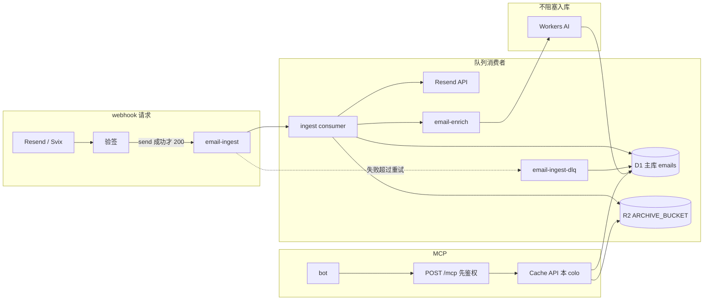

# P1 技术方案：把 Cloudflare 用满

状态：设计文档。不改 `wrangler.toml`、Worker 或迁移。下面所有配置和代码都是草案，只存在于本文。

核对日期：2026-09-28。额度以当天的官方文档为准，出处列在文末。P0 已合入 `origin/main`（合并提交 `d742bfd`）。本文按该提交上的 `worker/worker.js`、`worker/schema.sql`、`worker/wrangler.toml`、`e2e/run.mjs`、`skill/mail_archive.py`、`package.json` 校准。本分支仍只有这份文档。

## 范围

P0 的链路保持不变：Resend `email.received` / `email.sent` → 同一个 Worker 请求里验 Svix 签名（secret 名 `WEBHOOK_SECRET`）→ `archiveEvent` 按类型调 Receiving API 或 `GET /emails/:id` → D1 唯一的表 `emails`（主键 `resend_id`，绑定 `DB`）→ R2 绑定 `ARCHIVE_BUCKET` 写 `raw/{resend_id}.eml` 和 `attachments/{resend_id}/{sanitized-filename}` → 同一个 Worker 的 `POST /mcp`（Bearer `MCP_TOKEN`）提供 `search_emails`、`get_email`、`list_emails`、`email_stats`。另有未鉴权的 `GET /health`。

P1 只在这条链路上加 Cloudflare 原生能力：

1. Queues 把 webhook 收成「验签 + 入队」
2. Cache API 挡住重复读
3. Workers AI 在入库之后补中文摘要和标签
4. D1 Sessions API 预留读副本，并给单库 500 MB 准备分库
5. Workers Logs + Analytics Engine 观测
6. 用免费额度把「什么时候才值得开 $5 Workers Paid」算成数字

明确不做：Vectorize（要 Paid，而且 P0 的搜索是 SQL `LIKE`）、Durable Objects（幂等已经有 `emails.resend_id` 主键，DO 按墙钟计费）、Workflows（免费档每天 3,000 step，步骤模型和本链路不匹配）、KV（免费档每天 1,000 次写，且最终一致，不适合做幂等锁，也不适合存正文）。外部队列、Redis、OpenAI、Datadog 同样不引入，理由写在每一节。



## P0 事实

对照 `origin/main` @ `d742bfd`。编号沿用原稿的 A1–A15，正文直接用这里的事实。

| ID | 事实 |
| --- | --- |
| A1 | Webhook 在同一次请求里验签、调用 `archiveEvent`（Resend、R2、D1），然后才返回。没有队列。P1 从「验签成功」处切开，第 1 节是新增队列。`e2e` 用例 (a) 在 200 返回后立刻 `get_email`，用例 (b) 要求重放体是 `{ok:true,duplicate:true}`；切开之后这两条要改成等消费者落库（见文末阶段 Q）。 |
| A2 | 只有表 `emails`。主键是 `resend_id`。没有 `attachments` 表，没有 `events` 表。附件是列 `attachments`，JSON 数组 `[{filename, content_type, size, r2_key}]`。列：`resend_id`、`direction`（`in` \| `out`）、`msg_from`、`msg_to`（JSON 数组）、`cc`（JSON 数组）、`subject`、`date`（ISO8601）、`text_body`、`html_body`、`message_id`、`auth`（JSON，仅收件）、`attachments`、`created_at`。索引：`idx_emails_date(date)`、`idx_emails_from(msg_from)`。`direction` 为 `NOT NULL`，其余业务列可空。 |
| A3 | 不存 Svix 事件 id。幂等键是 Resend 邮件 id，落在 `resend_id`：主键 + 入库前 `SELECT` 短路 + `INSERT OR IGNORE`。Webhook 体里的字段名仍是 `data.email_id`，写入列名是 `resend_id`。不新增 `events.event_id`。 |
| A4 | Webhook 只读 `type`、`data.email_id`、`created_at`，正文不在载荷里。`email.received` → `GET /emails/receiving/:id` 与 `/emails/receiving/:id/attachments`；`email.sent` → `GET /emails/:id` 与 `/emails/:id/attachments`。分支已经在 `archiveEvent`。其它 `type` 验签后回 200 `{ignored:true}`，不入库。`email_id` 过不了 `isSafeResendId` 回 400。消费者沿用 `archiveEvent`，不要另写一套拉取。 |
| A5 | 附件和原始邮件走响应里的短时 `download_url`（只允许 `https` 且主机是 resend.com / resend.app / resend.dev）。`archiveEvent` 在 `INSERT` 之前下完。enrich 不许再调 Resend。发出邮件通常没有 `raw.download_url`，这时不写 `.eml`，也不算失败。 |
| A6 | MCP 在同一个 Worker：`POST /mcp`，Bearer `MCP_TOKEN`，协议 `2025-06-18`，工具只有四个，P1 不新增工具。`get_email` 的参数是 `resend_id`、`include_html`、`include_raw_eml`。附件字节不进 JSON，只有元数据和 `r2_key`。`include_html` 从 D1 的 `html_body` 读。`include_raw_eml` 用 `ARCHIVE_BUCKET.get` 再 `obj.text()`，把整封 `.eml` 放进 JSON。没有附件或原文的 HTTP 读取路由。`list_emails` 没有 cursor，参数是 `limit`、`direction`、`since`。`search_emails` 的参数是 `query`、`from`、`to`、`since`、`until`、`direction`、`limit`，`LIKE '%词%'` 打在 `subject`、`msg_from`、`text_body`。未知参数直接 JSON-RPC `-32602`。工具结果是 `{content:[{type:"text",text:<JSON>}]}`：`search` / `list` 的 JSON 是数组，`get_email` / `email_stats` 是对象。另有 `GET /health`（`ok`、`last_received_at`、`count_24h`）。`skill/mail_archive.py` 走 Cloudflare D1 HTTP API，不经过这个 Worker。 |
| A7 | `html_body` 和 `text_body` 都在 D1。原始 `.eml` 另外在 R2 的 `raw/{resend_id}.eml`（有 `raw.download_url` 时，主要是收件）。容量按「HTML 已在 D1」估算。发出邮件常常没有 `.eml`，不能把 R2 当成 HTML 的唯一副本。 |
| A8 | 单用户、单邮箱，没有 tenant 列。分库按 `date` 的年份。 |
| A9 | D1 绑定 `DB`，库 `abot-mail-archive`（`779058bf-f5c1-44de-b2c8-99350ec7748e`）。R2 绑定 `ARCHIVE_BUCKET`，桶 `abot-mail-archive`。Worker 名 `resend-agent-mail-relay`。 |
| A10 | Secret 三个：`WEBHOOK_SECRET`（`whsec_` + base64）、`RESEND_API_KEY`、`MCP_TOKEN`。P1 不新增外部密钥。AI 和 Analytics Engine 用绑定。告警信沿用 `RESEND_API_KEY`。 |
| A11 | `email_stats` 由 `buildStatsQueries` 实现，没有 `stats_daily`。四条 SQL：`COUNT(*)` 全表；`GROUP BY direction` 全表；`msg_from` 全表 `GROUP BY` 后 `LIMIT 10`；`substr(date,1,10)` 且 `date >= now-30d`。返回 `{total, by_direction:{in,out}, by_day:[{day,count}], top_senders:[{from,count}]}`。`skill/mail_archive.py` 的 `stats` 是同一套 SQL。 |
| A12 | 行一旦提交，重放在 `SELECT` 命中后立刻 200 `{duplicate:true}`，不再请求 Resend，不再写 R2。尚未提交（中途 500）或两个投递同时通过 `SELECT` 时，仍会再拉 Resend、再 `PUT` 同一个 R2 键；`INSERT OR IGNORE` 保证行数是 1，后写入的那次插入被丢掉。 |
| A13 | 键是稳定的：`raw/{resend_id}.eml`；`attachments/{resend_id}/{sanitized-filename}`。文件名去掉路径段，非 `[A-Za-z0-9._-]` 换成 `_`，去掉开头的点，截到 180 字符，空名变成 `attachment`。同一封里重名从 `2-` 起加前缀（`2-file.pdf`）。键里没有附件 id。缓存用行内已经写下的 `r2_key`，不要在读路径上重算。 |
| A14 | 没有 `summary`、`labels`、`ai_status`、`ingest_status`、`updated_at`。P1 若要这些列，全部可空。AI 或解析失败不得删除已经写入的 `emails` 行。已入库的行 `ingest_status` 为空，视同完成。 |
| A15 | 免费档硬顶不在仓库里，仍按文末出处：CPU 10 ms/次，请求 10 万/天，Queue 1 万操作/天且保留 24 h，D1 单库 500 MB、账号 5 GB / 10 库、行读 500 万/天、行写 10 万/天，R2 10 GB-月 + Class A 100 万/月 + Class B 1000 万/月且流出为 0，Workers AI 1 万 neurons/天，Workers Logs 20 万事件/天保留 3 天，Analytics Engine 10 万点/天。第 6 节里「每封多少次行写」已按真实表重算；硬顶数字不动。 |

## 1. Queues：webhook 只验签、只入队

### 为什么用 Cloudflare Queues，不用 SQS / Redis / 再开一个任务服务

webhook 和消费者是同一个 Worker、同一组绑定，入队是进程内的 `queue.send()`，没有第二套凭证，也没有出网。免费档每天 1 万次操作（2026-02-04 起 Queues 进入 Workers Free），个人邮箱用不满。死信、重试、积压都在同一块仪表盘上。

SQS 或 Redis 会把「已经在 Cloudflare 上的一次投递」再送出网络，还要单独做鉴权、死信和幂等。Workers 本身不出网免费，但对方会计费，故障域也变成两个。这个量级撑不起那份复杂度。

不用 Workflows 或 Durable Objects 来编排同一步：入库是「至少一次的后台作业」，不是多步长事务。队列就是这个模型。

### 行为

1. 读原始 body，验 Svix 签名。失败返回 401，不入队。Svix 对非 2xx 仍会重试，但重试停在验签，不产生队列消息。时间戳容差与 P0 相同，5 分钟。
2. 签名通过后，`type` 不是 `email.received` / `email.sent` 的，直接 200 `{ignored:true}`，不入队。`data.email_id` 过不了 `isSafeResendId` 的，直接 400，不入队。
3. 其余往 `email-ingest` 放一条小消息（1 KB 内）：`type`、`resend_id`（值来自 `data.email_id`）、`event_created_at`（值来自事件的 `created_at`）、`svix_id`（只给日志对账，不是幂等键）。不放正文。
4. `send()` resolve 之后立刻返回 200 `{ok:true,queued:true}`。`send()` 之前或当时失败，返回 500，让 Svix 以后再试。200 之后这次请求里不得再调 Resend、D1、R2。P0 的 `{duplicate:true}` 改由消费者短路产生，不再出现在 webhook 体里。
5. consumer 调用与 `archiveEvent` 相同的拉取和写入，成功则 `ack()`。可重试错误调用 `message.retry({ delaySeconds })`。不可重试错误直接 `ack()`，并把 `resend_id`、`type`、错误写进新表 `ingest_failures`（P0 没有事件表），避免把配额烧在必定失败的重试上。
6. 超过 `max_retries` 进 `email-ingest-dlq`。死信 consumer 把载荷和错误写入 `ingest_failures` 后 `ack()`。死信队列不再挂自己的死信队列。

免费档消息保留 24 小时，且不能改长。官方对「没有 consumer 的死信」另有 4 天的说法，和免费档 24 小时冲突。处理办法是死信必须有 consumer，失败记录落在 D1，不把队列当档案。

Resend 侧的正文保留期通常长于队列，但不是我们能控制的 SLA。consumer 要在 ack 前把 `.eml`（有下载 URL 时）和附件放进 R2。R2 写完并 `INSERT` 成功之后，Resend 不再是数据源。

### 草案：wrangler 片段

D1 / R2 绑定保持 A9：`DB`、`ARCHIVE_BUCKET`。下面只追加队列。`max_batch_size = 1` 是故意的：免费档 10 ms CPU 是按一次调用算的，一批 10 封会共享这 10 ms。付费档再把 ingest 的 batch 调到 10。

```toml
# 草案，不要抄进仓库里的 wrangler.toml

[[queues.producers]]
binding = "INGEST_QUEUE"
queue = "email-ingest"

[[queues.producers]]
binding = "ENRICH_QUEUE"
queue = "email-enrich"

[[queues.consumers]]
queue = "email-ingest"
max_batch_size = 1
max_batch_timeout = 1
max_retries = 5
max_concurrency = 2
dead_letter_queue = "email-ingest-dlq"

[[queues.consumers]]
queue = "email-ingest-dlq"
max_batch_size = 1
max_retries = 3
max_concurrency = 1

[[queues.consumers]]
queue = "email-enrich"
max_batch_size = 1
max_batch_timeout = 5
max_retries = 2
max_concurrency = 1
dead_letter_queue = "email-enrich-dlq"

[[queues.consumers]]
queue = "email-enrich-dlq"
max_batch_size = 1
max_retries = 2
max_concurrency = 1
```

`max_concurrency = 2` 把 Resend 的 429 挡在队列侧。默认并发会扩到平台上限，一封邮件的 429 会变成一串并发重试。收到 429 时用响应里的 `Retry-After`（没有就 60 秒）调用 `message.retry({ delaySeconds })`，不在消费者里 `sleep` 空转。

`email-enrich` 与入库分开，见第 3 节。AI 失败不许把已经写好的邮件重新送回 Resend。阶段 A 可以只部署 enrich 队列：在现有 `archiveEvent` 成功 `INSERT` 之后 `send()`，不必等阶段 Q。

```sql
-- 草案。死信落点。P0 没有 events 表，不要借那张表。
CREATE TABLE IF NOT EXISTS ingest_failures (
  id         INTEGER PRIMARY KEY AUTOINCREMENT,
  resend_id  TEXT,
  type       TEXT,
  error      TEXT,
  created_at TEXT DEFAULT (strftime('%Y-%m-%dT%H:%M:%fZ','now'))
);
```

### 消费者幂等

Queues 是至少一次，Svix 也是至少一次。重复来自：Svix 没看见 200 又投了一次、consumer 在 `ack` 前崩溃、手工 replay。

幂等只有一级：`emails.resend_id` 主键。Svix id 可以写进日志，不入库，也不参与冲突检测。`email.received` 和 `email.sent` 共用这一列；`direction` 是普通列。P1 不把主键改成 `(resend_id, direction)`。

处理顺序与 P0 的 `archiveEvent` 对齐：

1. 用主库。`SELECT resend_id FROM emails WHERE resend_id = ?`。命中则 `ack()`，不再请求 Resend，不再 `PUT` R2。这就是今天重放得到 `{duplicate:true}` 的那条短路，消费者必须保留。
2. 未命中才拉 Resend。收件走 Receiving，发件走 `GET /emails/:id`，附件列表走对应的 `/attachments`。有 `raw.download_url` 才写 `raw/{resend_id}.eml`。附件键用 `buildAttachmentKey`：`attachments/{resend_id}/{sanitized-filename}`。P0 这里直接 `PUT`。未提交重试会再打一次 Class A；消费者可以先 `head`，没有对象再 `put`。
3. `INSERT OR IGNORE` 写入 A2 的列。D1 `run()` 的 `meta.changes = 0` 表示并发的另一边已经插入，行数仍是 1。`archiveEvent` 今天不把 `changes` 返回给调用方，阶段 Q 要带出来。
4. `changes = 1` 才往 `email-enrich` 投一条 `{ resend_id }`。`changes = 0` 只 `ack()`。重复的 enrich 消息由 enrich 自己短路。
5. `ack()`。

P0 的缺口只在「行还没提交」：上一次在 `INSERT` 前失败，或两个消费者同时通过 `SELECT`。这两种都会再拉 Resend、再 `PUT` 同一 R2 键。要收紧这个窗口，给 `emails` 加可空列 `ingest_status`、`updated_at`，并改 `archiveEvent` 的短路条件：`ingest_status` 为 `complete` 或 `NULL`（已有行）才跳过；`processing` 继续做完拉取。不能在现有函数前面先插一行占位，否则今天的 `SELECT` 会把占位行当成重复，跳过 Resend，留下空正文。

占位认领启用之后的顺序：

1. 主库 `SELECT`。`complete` 或 `NULL`：`ack()`。
2. 没有行：插入 `resend_id`、`direction`、`ingest_status = 'processing'`、`updated_at`。主键冲突则读现有行。
3. `processing` 且 `updated_at` 在 10 分钟内：`retry({ delaySeconds: 30 })`。超过 10 分钟则接管，刷新 `updated_at`。
4. 只有认领成功或接管成功才执行上面的拉取和 R2。全部对象落定后 `UPDATE` 同一行的正文列，并把 `ingest_status` 设为 `complete`。
5. 再投 enrich，然后 `ack()`。

不可重试、应直接 ack 并记入 `ingest_failures`：Resend 404（邮件已不在）、401/403（密钥错了，重试不会好）、载荷缺 `resend_id`（这类应在入队前就被 400 挡下）。

可重试：Resend 429、Resend 5xx、D1/R2 临时错误、调用被 CPU 限制杀掉（平台会自己重投，应用代码看不到异常）。

### Resend 重试风暴

Resend 的自动重试日程（失败后顺延）：立即、5 秒、5 分钟、30 分钟、2 小时、5 小时、10 小时、再 10 小时。约 8 次，跨 28 小时左右。手工 replay 还会在此之外再来一次。任何非 2xx 都算失败，包括 401。

队列侧：成功投递约 3 次操作（写、读、删）。每重试一次多 1 次读。消息小于 64 KB（我们远小于此），不按块翻倍。死信再加 1 次写。

| 场景 | Svix 打到 Worker 的次数 | 入队条数 | 队列操作，大约 | 打到 Resend API |
| --- | --- | --- | --- | --- |
| 正常，`send()` 后 200 | 1 | 1 | 3 | 1 |
| Worker 挂了或在 `send()` 前 500，持续约 2 小时 | 4（立即、5 秒、5 分、30 分） | 0 | 0 | 0 |
| 错误实现：入队之后还在 webhook 里做入库，入库失败仍返回 500 | 约 6（12 小时内） | 6 | 18，再乘 consumer 重试 | 若 consumer 不短路，最多 6 × (1 + 重试次数) |
| P1：200 只代表入队；consumer 遇 429 重试 2 次后成功 | 1 | 1 | 3 + 2 次读 | 3 次调用，1 次成功 |
| 行已提交后又被手工 replay | +1 | +1 | +3 | 0，消费者第 1 步短路 |
| 行尚未提交时重试或并发双投 | 1 或更多 | 同等 | 每条消息约 3，外加重试读 | 每个未提交的尝试各 1 次；R2 可能对同一键再 PUT；D1 行数仍为 1 |

风暴要防的是第三行。防护就三条：

- webhook 在 `send()` 成功后没有别的工作，成功就 200。Svix 的指数退避只覆盖「我们没接住」的窗口，不会和 consumer 的重试叠乘。
- 已提交的 `resend_id` 在请求 Resend 之前短路。重放的成本是一次主键点查，不是又一次把正文拉下来。
- `max_retries = 5`、`max_concurrency = 2`、429 按 `Retry-After` 推迟。不要用默认的「失败立刻再投 + 并发拉满」。

数量级：200 封邮件若走了第三行（平均 4 次 Svix 重试，consumer 又把 5 次重试用完再进死信），操作数大约 `200 × 4 × 7 ≈ 5,600`，再加死信 consumer，有机会在一天内靠近 1 万操作的免费顶。同样 200 封走 P1 的正确路径，即使其中一半 429 重试两次，也是 `200 × (3 + 1) ≈ 800` 次操作。所以「会不会被 Resend 打爆」取决于 200 的时机，不取决于要不要用队列。

鉴权失败保持 401，不要为了消重试改成 200。那几次重试没有入队，便宜，而且 200 会把伪造请求记成成功。

## 2. 边缘缓存

### 为什么用 Cache API，不用 Redis / KV / 在前面套一层 CDN

要挡的是「同一个 bot 在短时间里把同一封邮件或同一份统计再读一次」，不是全球分发。`caches.default` 就在处理这次请求的 colo 里，命中后不再打 D1 和 R2，没有单独的产品费。

KV 免费档每天 10 万次读、1,000 次写，写配额比队列还紧，而且是最终一致的，不适合当刚入库邮件的缓存。Redis 要出网、要运维。CDN 缓存规则不能用在 `POST /mcp` 上：缓存在 Worker 之前就会跳过 Bearer 鉴权。`/mcp` 的响应不要带可被边缘缓存的 `Cache-Control: public`。P0 的 JSON 响应已经是 `cache-control: no-store`，保持这样。

缓存放在鉴权之后，用 Worker 自己构造的 GET 键，客户端决定不了键。`skill/mail_archive.py` 直接打 D1 HTTP API，不经过 Cache API；汇总表要在技能里读同一套 SQL，缓存盖不住那条路径。

### 零流出用在哪里

R2 流出为 0，Workers 响应带宽也不计费。和 S3 相比，差的就是这一项：bot 反复把一封 5 MB 的附件拉走，在 R2 上只有 Class B 次数，没有按 GB 的流出账单。100 GB/月的重复下载，S3 流出大约是 9 美元量级，这里是 0。

因此不需要为了省钱做「外链签名 URL 绕开 Worker」或「正文只留摘录、逼 bot 去别处下」。字节可以经 Worker 流出。要控制的是 Worker 内存（128 MB）和免费档 10 ms CPU，不是流量费：

- 附件本来就只以对象存在 R2。`get_email` 返回的 `attachments[]` 已是 `filename`、`content_type`、`size`、`r2_key`，不要改成 base64。
- `get_email` 默认返回元数据、`text_body`，以及（阶段 A 之后）摘要和标签。`html_body` 仅当 `include_html=true`。
- `include_raw_eml=true` 时 P0 把整封 `.eml` 经 `obj.text()` 放进 JSON。这是 10 ms CPU 的实际风险点。P1 加一条鉴权后的流式读取：`R2Object.body` 直接作为 `Response` body，键只接受 `raw/{resend_id}.eml` 或该行 `attachments[].r2_key`。大于 256 KB 的原文不再塞进 `get_email` 的 JSON，结果里保留键和大小。小原文可以继续内联。不要为了协议整齐把 10 MB 附件编码进 JSON。

个人量级下，缓存省下的钱接近 0：Class B 免费额度是每月 1,000 万次，D1 行读是每天 500 万。缓存的收益是延迟，以及别让 `email_stats` 的全表扫描把行读配额打穿（见第 4、6 节）。零流出解决的是「敢不敢把原文存下来并交给任意 bot」，缓存解决的是「同一份东西别反复解析」。

Cache API 是按 colo 的，不是全球一条缓存。bot 若固定从一个区域来，`get_email` 的重复读命中率会高；bot 散落多地，命中率会低，这不是故障。不要为了抬命中率去买 Cache Reserve。

### 哪些可以缓存

`raw/{resend_id}.eml` 和 `attachments/{resend_id}/{sanitized-filename}` 在写入后不再改名（A13）。摘要会从「还没有」变成「有了」，所以在 `ai_status` 列存在之后，元数据的缓存键要带上它。阶段 C 单独上线、列还不存在时，键里用 `ai=none`，`get_email` 可以缓存：P0 入库之后正文不再改。阶段 A 给列赋值之后，`pending` 和 `null` 不缓存。

`email_stats` 没有日期参数，返回的是一份总览加近 30 天窗口。缓存键是一枚，不是 `stats:{day}`。

| 数据 | 是否缓存 | TTL | 键 | 失效 |
| --- | --- | --- | --- | --- |
| `get_email`。有 `ai_status` 列时，仅 `ok` / `failed` / `skipped` / `deferred` | 缓存 | 24 h | `GET https://cache.internal/mcp/get?id={resend_id}&html={0\|1}&raw={0\|1}&ai={status}` | `include_html` 和 `include_raw_eml` 改变 JSON，必须进键。摘要写上之后 `ai` 变了，旧条目等 TTL。`pending` 和 `null` 不缓存 |
| R2 上的 `.eml`、附件 | 缓存 | 7 天 | `GET https://cache.internal/r2/{r2_key}`，`r2_key` 为 `raw/{resend_id}.eml` 或行内的 `attachments[].r2_key` | 对象不可变，不主动删。Cache API 单对象上限之内（邮件附件远小于此） |
| `search_emails` | 只挡同一次对话里的重复调用 | 10 s | `query`、`from`、`to`、`since`、`until`、`direction`、`limit` 排序后的哈希（不含 token） | 只靠 TTL。邮箱是追加写的，长 TTL 会让 bot 看不见刚到的信 |
| `list_emails` | 同上 | 10 s | `limit`、`direction`、`since` 的哈希。没有 cursor | 同上 |
| `email_stats` | 缓存 | 120 s | `GET https://cache.internal/mcp/stats` | TTL。工具无参数。近 30 天窗口随 `now` 移动，所以 TTL 保持两分钟 |
| 按标签的分布（阶段 A 有 `labels` 之后） | 缓存 | 120 s | `stats:labels` | 允许落后于 enrich。文档里写明，bot 不要把它当实时值 |
| webhook、队列消费、`/health`、任何 401 | 不缓存 | — | — | — |

`search` / `list` 的查询词来自模型时，分布很散，命中率可能接近 0。这是预期，不要把 TTL 加到几分钟去「做高命中率」。真正值得长 TTL 的是按 `resend_id` 取信和 R2 对象。

P0 的工具 schema 是 `additionalProperties: false`，多一个字段就会 `-32602`。阶段 C 给四个工具的允许列表加上可选 `fresh`（布尔）。`fresh: true` 绕过缓存。刚入库、`ai_status` 仍为空的 `get_email` 走主库，不会读到副本上或缓存里的旧「不存在」。

草案，鉴权之后：

```js
// 草案。只说明键和 TTL，不是要提交的实现。
async function cachedGet(env, ctx, args) {
  const cache = caches.default;
  const ai = args.aiStatus || "none";
  const key = new Request(
    "https://cache.internal/mcp/get?id=" +
      encodeURIComponent(args.resendId) +
      "&html=" + (args.includeHtml ? "1" : "0") +
      "&raw=" + (args.includeRaw ? "1" : "0") +
      "&ai=" + encodeURIComponent(ai)
  );
  const hit = await cache.match(key);
  if (hit) return { response: hit, hit: true };
  const response = await loadEmailFromD1(env, args.resendId); // 见第 4 节的 session
  ctx.waitUntil(cache.put(key, response.clone()));
  return { response, hit: false };
}
```

`cache.put` 的响应用 200，并带上私有的 `Cache-Control: max-age=...`。不要把这枚响应原样透传成可以被 CDN 缓存的 MCP 响应。

## 3. Workers AI：入库后打标签、写中文摘要

### 为什么用 Workers AI，不用外部模型 API

正文不出 Cloudflare。没有第二把 API key，调用是绑定的 `env.AI.run`。免费档每天 1 万 neurons，用尽的行为是当天失败，而不是默默扣钱。失败时降级路径就是「这封邮件没有摘要」，MCP 四个工具照常返回已有字段。

外部模型要把信件正文送到别人的 GPU 上，隐私和故障域都更差。这个功能是附加的，不值得为它单独买一个模型账号。

不用推理模型（QwQ、带 thinking 的大模型、文档标明要 Paid 或预付费的 Kimi / GLM / DeepSeek V4）。摘要是短 JSON，推理 token 会把 1 万 neurons 提前烧完。

### 模型

主模型：`@cf/qwen/qwen3-30b-a3b-fp8`。

- 中文是训练语言之一，3B 激活参数的 MoE，适合「摘录 + 闭集标签」，不必上 32B/70B。
- 标价与 `@cf/meta/llama-3.2-3b-instruct` 同一档：输入 4,625 neurons / 百万 token，输出 30,475 neurons / 百万 token（约 $0.051 / $0.335 per M tokens）。
- Qwen3 默认可能产出 thinking。调用时必须关掉 thinking（`enable_thinking: false` 或等价参数），并把 `max_tokens` 限制在 320。若绑定不支持关闭 thinking，改用备选，不要带着思维链跑。

备选：`@cf/meta/llama-3.1-8b-instruct-fp8-fast`（输入 4,119、输出 34,868 neurons / 百万 token）。中文弱于 Qwen3，但没有思维链这一项不确定因素。`llama-3.2-1b` 更便宜，中文摘要质量不够，不用。

闭集标签：`通知`、`账单`、`验证码`、`往来`、`订阅`、`广告`、`工作`、`旅行`、`其他`。模型只输出 JSON：`{"summary":"...","labels":["账单"]}`。摘要不超过 80 个汉字。解析失败或标签不在闭集里，记 `ai_status = failed`，不把原文写进标签列。

新增可空列：`summary`、`labels`（JSON 数组）、`ai_status`。已有邮件这三列为空。失败时只 `UPDATE` 这三列，不 `DELETE` 邮件行。

输入只带：`msg_from`、`msg_to`、`subject`、`text_body` 的摘录。摘录截到约 1,200 个汉字。有 `text_body` 就用它，不要在消费者里对一整封 `html_body` 做正则去标签（这是 10 ms CPU 最容易被打穿的地方）。只有 HTML 时，先截到 4,000 字符再去掉标签，仍然只发生在 enrich consumer 里。

按 Qwen 中文大约 1.5 字一个 token 估算（落地后用响应里的 usage 替换这个估算）：

| 部分 | token | neurons |
| --- | --- | --- |
| 输入：提示约 300 + 正文约 800 | 1,100 | 1,100 / 1e6 × 4625 ≈ 5.1 |
| 输出：上限 320，正常约 200 | 200 | 200 / 1e6 × 30475 ≈ 6.1 |
| 每封合计 | | **约 11** |

1 万 neurons / 11 ≈ **每天约 900 封**仍在免费额度内。个人邮箱按 50 封/天（收+发）大约用掉 550 neurons，占额度 6%。不截断、把 8,000 token 的 HTML 全送进去时，一封会到 40 neurons 以上，额度大约只够 250 封/天，所以截断是额度策略的一部分，不是可选项。

这些是规划数字。真正入账以 Workers AI 返回的 token 为准，记到 Analytics Engine（第 5 节），不记正文。

### 不阻塞入库

AI 不在 webhook 里，也不在 ingest 的同一次调用里。`emails` 行 `INSERT` 成功之后，另投 `email-enrich`，消息体是 `{ resend_id }`。阶段 Q 未上线时，由 `archiveEvent` 在插入成功后入队；阶段 Q 已上线时，由 ingest consumer 在 `ack` 之前入队。两条入口不要同时开。

这样拆的原因：

- Workers AI 的墙钟经常是数秒。放在入库调用里会拖住 ack，崩溃后又把 Resend 拉取重做一遍（A12 的未提交窗口）。
- AI 配额用尽、模型超时、JSON 不合格，都不应该让邮件消失或进 ingest 死信。
- 多出来的成本是每封大约 3 次队列操作。50 封/天就是 150 次，相对每天 1 万的额度可以忽略。

enrich 短路：主库上 `ai_status = 'ok'` 则直接 ack。`max_concurrency = 1`，重复消息是串行的，第二次会看见 `ok`。崩溃发生在模型已成功、写库之前时，重试会再调用一次模型；个人量级接受这一种重复，不为它做分布式锁。enrich 不调用 Resend，不读下载 URL。

降级：

| 失败 | `ai_status` | 要不要重试 |
| --- | --- | --- |
| 模型 5xx、网络超时 | `failed` | 用队列重试，最多 2 次，然后进 enrich 死信。死信只记账，不阻塞读取 |
| 输出不是合法 JSON，或标签越界 | `failed` | 不重试。同样的提示词再跑一次，大概率还是坏的 |
| 当天 neurons 用尽 | `deferred` | 不重试。次日 01:20 UTC 的 cron 再投递（额度 00:00 UTC 重置）。cron 只挑选 `deferred`，每天一条队列消息一封，不要在午夜打出并发 |
| `text_body` 与 `html_body` 都空、只有附件 | `skipped` | 不调用模型 |

MCP 在摘要缺失时返回邮件的其余字段（`text_body`、`html_body` 按原参数）。`search_emails` 不把「有摘要」当过滤条件，除非调用方明确要标签。标签过滤若要做，用 `email_labels(resend_id, label)`，并且只在查询证明需要之后再加；`summary` / `labels` 列上先不建索引。

额度用尽不会在免费档产生账单，调用直接失败。要在同一天继续打标签，才需要 Workers Paid；超出的部分是 $0.011 / 1,000 neurons。按每封 11 neurons，多出来的 1,000 封大约是 $0.12。真正的门槛是每月 5 美元的套餐，不是 neurons 单价。个人邮箱不值得为了「第 901 封也要当天有摘要」去开套餐；`deferred` 到次日即可。

### CPU

等模型返回的时间不算 CPU。enrich 调用里算 CPU 的是截断文本、解析 JSON、更新一行。这应当远小于入库那次对大 JSON 的 `JSON.parse`，也远小于 `include_raw_eml` 的 `obj.text()`。AI 因此不是逼你开 Paid 的原因；大正文解析才是（第 6 节）。

## 4. D1 读扩展

### 为什么继续用 D1，不开外置数据库，也不为了读扩展去分库

主库在免费档已经是一个单线程的 Durable Object：个人邮箱的写入每秒远小于 1，读和写互相挡住的情况不会先出现。D1 读副本不另收存储费和计算费，行读行写照旧。Sessions API 让「先把代码写成可路由、以后再在仪表盘打开副本」成为一次配置，而不是一次迁移。

PlanetScale、带只读副本的 Postgres，解决的是连接数和跨区读。这里没有连接池问题（Worker 绑定没有握手），跨区读等度量数据出现再开副本即可。把数据搬出去会失去 Time Travel（免费档 7 天、付费档 30 天）和「行读行写」这种可预期的账单。

分库解决的是单库 500 MB 硬顶，不是 QPS。不要为了读扩展提前分库。

### 现在的官方限额（容易和「5 GB」混在一起）

| | Workers Free | Workers Paid |
| --- | --- | --- |
| 单库硬顶 | **500 MB** | **10 GB**（不能再提高） |
| 账号存储 | 5 GB | 含 5 GB，超出 $0.75 / GB-月；账号硬顶 1 TB |
| 库数量 | 10 | 50,000 |
| 行读 | 500 万 / 天 | 每月含 250 亿，超出 $0.001 / 百万行 |
| 行写 | 10 万 / 天 | 每月含 5,000 万，超出 $1.00 / 百万行 |

读副本不增加 500 MB，也不把行再算一份钱。

### 什么时候开读副本

默认不开。同时满足下面两条再开：

- MCP 的读者和主库不在同一区域，或者索引查询的 p95 超过 150 ms；
- 这段延迟出现时，ingest 的积压也在涨（主库上的读把写堵住了）。

只满足第一条时，先确认是不是缺索引（缺索引会放大行读和延迟）。`date` 和 `msg_from` 上已经有索引。bot 又和主库同区时，副本没有收益。

代码从第一天就走 Sessions API，打开副本时不用改查询：

| 调用方 | session | 原因 |
| --- | --- | --- |
| ingest、enrich、死信、幂等判断 | 直接用绑定，或 `withSession("first-primary")` | 必须读到自己刚写的行。副本为空时会把「已入库」误判成「要再拉一次 Resend」 |
| `get_email` | 调用方若带上一次返回的 bookmark，用 bookmark；否则 `first-primary` | 刚入库的读取不能落在还没跟上的副本上 |
| `search_emails`、`list_emails`、`email_stats` | `withSession("first-unconstrained")` | 允许落后几秒。列表本来就有 10–120 秒缓存 |

`search` / `list` 的文本 JSON 必须仍是数组，`get_email` / `email_stats` 的文本 JSON 保持今天的对象形状。bookmark 放在 MCP 结果的 `_meta.bookmark`（`session.getBookmark()`），不要塞进数组元素。bot 链式调用时把 bookmark 送回来，同一次对话里的读是顺序一致的。

写始终进主库，即使 session 是 unconstrained。ingest 不要用 unconstrained 去做「有没有这行」的判断。

不为 MCP Worker 开 Smart Placement。Placement 会把请求拉到主库附近，读副本的就近就没有了。

### 行读怎么才不会先被 stats 打穿

`buildStatsQueries` 里 `COUNT(*)`、`GROUP BY direction`、`GROUP BY msg_from ... LIMIT 10` 都是全表扫描。`by_day` 有 `date >= ?`，能用 `idx_emails_date`。库里有 5 万行、每分钟一次 `email_stats`：三次全表大约 `1440 × 3 × 50,000 ≈ 2 亿` 行读/天，免费档 500 万的顶在容量还早的时候就会到。`skill/mail_archive.py stats` 打的是同一组 SQL，缓存挡不住。

保留返回形状 `{total, by_direction:{in,out}, by_day, top_senders}`。用两张小表替换全表聚合，只在 `INSERT` 真正写入时（`changes = 1`，或认领行首次变成 `complete`）递增。重放短路不加。

```sql
-- 草案。day 取自 emails.date 的 UTC 日期，不是 created_at。
CREATE TABLE stats_daily (
  day      TEXT PRIMARY KEY,             -- YYYY-MM-DD
  inbound  INTEGER NOT NULL DEFAULT 0,   -- direction = 'in'
  outbound INTEGER NOT NULL DEFAULT 0    -- direction = 'out'
);

CREATE TABLE stats_sender (
  msg_from TEXT PRIMARY KEY,
  count    INTEGER NOT NULL DEFAULT 0
);
```

`email_stats` 的读法：`total` 与 `by_direction` 对 `stats_daily` 求和；`by_day` 取 `day >= today-30d`；`top_senders` 对 `stats_sender` `ORDER BY count DESC, msg_from ASC LIMIT 10`。空 `msg_from` 不进 `stats_sender`，与今天的 `WHERE msg_from IS NOT NULL AND msg_from != ''` 一致。`skill/mail_archive.py` 的 `stats` 改读这两张表，避免 MCP 和 CLI 各扫一遍 `emails`。

标签分布单独查，并且只扫描「有标签且 `date` 落在时间窗内」的行，要求 `ai_status` 与 `date` 上有能用的索引；没有这张时间窗就不要提供「全历史标签分布」。`idx_emails_date` 已经在。`ai_status` 上的索引等标签查询真的出现再加。

二次索引会让写入行数变多（行本身一行，索引一行）。P0 已经有 `idx_emails_date` 和 `idx_emails_from`，每封大约 3 次行写。摘要和标签列不要建索引，除非真的按标签过滤。

`search_emails` 的 `since` / `until` 打在 `date` 上，已有 `idx_emails_date`。`from` 的 `LIKE '%词%'`、以及 `query` 对 `subject` / `msg_from` / `text_body` 的前导通配，用不上 `idx_emails_from`。无索引的 `LIKE '%词%'` 会扫全表，既慢又贵，不靠副本来解决，也不要为了 `LIKE` 再加一张索引指望它生效。

### 500 MB 增长预案

P0 已经把完整 `text_body` 和 `html_body` 放进 D1，`.eml` 在有下载 URL 时另外进 R2。容量按 HTML 在 D1 来估。发出邮件通常没有 `raw.download_url`，删掉 `html_body` 会让发件失去 HTML 副本；若以后要搬，只搬收件，并让 `include_html` 改读 R2。那是一次独立迁移，不是本设计的默认布局。

粗算，50 封/天：

| D1 里每封留下的东西 | 单行大约 | 写满 500 MB | 50 封/天能撑 |
| --- | --- | --- | --- |
| 现状：元数据 + 全文 `text_body` + 全文 `html_body`（按平均 50 KB HTML） | 50 KB | 约 1 万封 | 约 200 天 |
| 若以后把收件 HTML 迁出 D1，只留元数据 + 约 2 KB 纯文本 + 摘要 | 3 KB | 约 17 万封 | 约 9 年 |

附件不进 D1 的行，它们在 `attachments` JSON 里只有键和大小。R2 的 10 GB 是另一条曲线，按每天 50 封：

| 平均每封（含 `.eml` 和附件） | 年增量 | 写满免费 10 GB |
| --- | --- | --- |
| 100 KB（通知为主，附件很小） | 约 1.8 GB | 约 5 年 |
| 0.7 MB | 约 13 GB | 约 9 个月 |
| 3 MB（照片） | 约 55 GB | 约 2 个月 |

发出邮件通常不加那一封 `.eml`。这是 R2 价目，不是 Workers Paid 的开关，见第 6 节。附件一大，R2 会比 D1 的 500 MB 更早碰到免费顶；HTML 留在 D1 时，500 MB 大约先到。

免费档的分库，触发条件用「预计 30 天内越过 400 MB」，不要等到插入失败。

- 按年一库：`emails-2026`、`emails-2027`。年份取 `emails.date`（邮件日期，不是 Worker 时钟，也不是 `created_at`）。单用户不按邮箱拆（A8）。
- 另有一个目录库 `emails-dir`：`resend_id → shard`。`get_email` 先查目录再查年库。目录行只有 id，20 万封也是几 MB 到十几 MB，不会先满。
- 免费档 10 个库的预算：1 个目录 + 9 个年库。年和 500 MB 同时写满时，账号 5 GB 也到了，这就是免费档的终点。
- 唯一约束在年库内部，键仍是 `resend_id`。跨年边界的重放若插错库，目录冲突能看出来，再查相邻年。
- `search` / `list` 默认只查当年和上一年。每多查一个库就是一次子请求，免费档每次调用最多 50 次子请求，不要对 9 个库扇出。更老的年份要调用方显式给 `year`。
- 轮转到新库时，把旧库的 `stats_daily` 合计冻结进目录库的 `stats_archive`。`email_stats` 读「归档合计 + 当前库的 `stats_daily` / `stats_sender`」，不跨库扫 `emails`。
- 超过两年的库不再接收新业务写入。回填和 replay 若带着旧的 `date`，仍然写回那一年。

付费档的另一条路更简单：单库硬顶变成 10 GB。HTML 留在 D1 时，个人量级仍可能在付费档里碰到 10 GB，到了再分库。10 GB 仍是硬顶，付费也不提供「把这一库调到 50 GB」。想继续 0 美元就走年库。分库和开 $5 不要一起做。

Time Travel 用来挽回错误的 `UPDATE` / `DELETE`（免费 7 天）。它不覆盖 R2 里的对象，也不替代 `ingest_failures`。

## 5. 可观测性

### 为什么用 Workers Logs 和 Analytics Engine，不用 Datadog / Axiom

个人量级的日志量是每天几百到几千条，落在免费档 20 万事件/天、保留 3 天里面。Analytics Engine 免费档每天 10 万个数据点、1 万次读，而且 `writeDataPoint` 不计额外延迟。队列积压、Worker 错误率、D1 存储在仪表盘上已经有，不必再采集一遍。

外部 APM 要把日志推出去。Logpush 只在 Workers Paid 上提供，推出去的内容还会碰到邮件元数据。先把「不记录正文」做死，再谈要不要更长的保留期。付费档日志是每月含 2,000 万事件、超出 $0.60 / 百万，保留 7 天；个人量级开了套餐也不会在日志上产生超额。

P0 今天用 `console.log` / `console.error` 打了验签失败原因、`archived`（含 `email_id`）、webhook / health / mcp 的错误信息。阶段 O 收成每条调用一条结构化日志，字段名改用 `resend_id`。

### 记什么

平台已经有的，不重复造：

- Worker：请求数、错误率、CPU 时间、墙钟。CPU p99 是第 6 节里决定要不要开 Paid 的指标。
- Queues：积压（backlog）和消费延迟。深度以这个为准，不要用 cron 去 `list` 队列。阶段 Q 未部署时没有这张图，跳过即可。
- D1：存储字节、行读、行写。400 MB 预警看这个图。
- Workers AI：neurons。用它核对第 3 节的估算。阶段 A 未部署时这项为 0。

Workers Logs 打开，并且每条调用只打一条结构化日志。不打正文、摘录、摘要、主题、地址、token、签名。

```toml
# 草案
[observability]
enabled = true
head_sampling_rate = 1
```

采样在个人量级保持 1。MCP 请求超过每天 2 万次时，把读请求的 `head_sampling_rate` 降到 0.1，ingest / enrich / 死信保持全量。按调用采样，不要按「每条 SQL」打日志。

Analytics Engine 记业务量，一个调用一个点：

| 数据集字段 | 含义 |
| --- | --- |
| blob `stage` | `webhook`、`ingest`、`enrich`、`dlq`、`mcp`、`health`。某阶段还没部署时就不会出现 |
| blob `outcome` | `ok`、`duplicate`、`retry`、`dlq`、`unauthorized`、`ignored`、`fresh` |
| blob `tool` | MCP 工具名，其它阶段为空 |
| double `lag_ms` | ingest 完成时：`now - event_created_at`（入队消息里的事件时间）。不要用 `emails.date`（那是 Date 头），也不要用 `created_at`（那是插入时间，减出来接近 0） |
| double `wall_ms` | 本次调用墙钟 |
| double `cache` | `1` 命中，`0` 未命中，非读路径不写 |
| double `neurons` | enrich 从模型 usage 换算的估算，没有 usage 就写 0 |

`resend_id` 可以进 Workers Logs（3 天，用来把死信和邮件对上），不要进 Analytics Engine 的高基数索引。Analytics Engine 的 index 用 `stage` 这种低基数。

草案：

```toml
[[analytics_engine_datasets]]
binding = "METRICS"
dataset = "mail_metrics"
```

### 告警

免费档没有「自定义指标超过阈值就呼叫」的原生告警。分成两层：

1. 仪表盘通知（零代码）：Worker 错误率升高、脚本抛错。队列积压和 D1 存储每天看一次图即可，个人邮箱不需要值班。队列图在阶段 Q 之后才有。
2. 每日 cron（01:20 UTC。和第 3 节的 `deferred` 重试可以是同一个触发器；阶段 A 未上线时，这个 cron 只做告警。免费档 cron 一共只有 5 个名额）。查 D1 里**已经存在**的对象：`emails` 的 `count_24h` 可以用现有 `buildHealthQuery` 的形状；`ingest_failures`、`stats_daily`、`ai_status` 计数仅在对应阶段建出表或列之后才查。越界才用已经存在的 `RESEND_API_KEY` 给自己发一封邮件。不要为了告警再接一个监控 SaaS，也不要在 Worker 里放 Cloudflare API token 去查 Analytics Engine SQL。Analytics Engine 留给事后排查。

阈值：

| 信号 | 阈值 | 级别 | 说明 |
| --- | --- | --- | --- |
| webhook 5xx | 15 分钟内 > 1% | 立刻看 | 说明 200 没发出去，Svix 风暴开始了 |
| ingest 失败后进入重试的比例 | 15 分钟内 > 5% | 立刻看 | Resend 或 D1 在失败。阶段 Q 之后才有 ingest |
| `ingest_failures` 新增 | 任何一天 > 0 | 当天处理 | 免费档队列 24 小时会过期，所以死信必须已经落表；告警的是表，不是队列深度 |
| ingest `lag_ms` p95 | > 60 秒，持续 15 分钟 | 当天处理 | 个人邮箱正常是秒级。队列积压图应同时上升 |
| 队列积压 | > 100，或连续 10 分钟上升 | 当天处理 | 用 Queues 自带图 |
| CPU p99 | > 8 ms | 开 Paid 的判据 | 免费档硬顶 10 ms。这是容量信号，不是故障 |
| `get_email` 缓存命中率 | 预热后连续 7 天 < 30% | 只记录 | bot 分散或键设计错了。不呼叫。阶段 C 之后才有 |
| enrich `failed` + `deferred` | 1 小时内 > 20% 的入库量 | 当天处理 | 读取仍正常。看是不是 neurons 用尽。阶段 A 之后才有 |
| 当日 neurons 估算 | > 8,000 | 当天处理 | 接近 1 万。确认截断还在 |
| 单库体积 | > 400 MB | 30 天内做分库或开 Paid | 第 4 节。HTML 已在 D1，这条会比「只存摘录」更早到 |
| R2 存储 | > 8 GB | 计划附件保留策略 | 不强制 Workers Paid |
| Worker 请求 | > 8 万/天 | 看是哪个 bot 在轮询 | 硬顶 10 万 |
| 队列操作 | > 8,000/天 | 看重试是不是叠乘了 | 硬顶 1 万。阶段 Q 或阶段 A 之后才有 |

命中率的算法：MCP 读路径上 Analytics Engine 的 `cache` 字段，按天 `sum(cache) / count()`。`fresh: true` 记成 outcome `fresh`，不要算进命中率。

## 6. 成本模型

### 为什么这套账可以停在免费档

P0 和 P1 用到的请求、SQL、对象、模型和日志都在同一个 Workers 账号的免费包含量里，而且没有流出一项。外部替代会把「接近 0」拆成几张按量和按主机的账单，同时把信件正文送出去。$5 Workers Paid 是整账号的地板价：要么 0，要么至少 5。中间不存在「只给队列付 0.4 美元」的档。所以决策是一个开关，开关的条件必须是某个免费硬顶，而不是「感觉该上付费了」。

下面的「个人基线」：每天 40 封收到 + 10 封发出，平均 1.2 个附件，MCP 每天 `search` 200、`get` 100、`list` 50、`stats` 20，共 370 次读。双队列（ingest + enrich），无重试。D1 按现状保留全文 HTML。

| 维度 | 免费硬顶 | 基线每天占用 | 占用比例 | 越过之后 |
| --- | --- | --- | --- | --- |
| Worker 请求 | 10 万/天 | webhook 50 + ingest 50 + enrich 50 + MCP 370 ≈ **520** | 0.5% | Error 1027。webhook 开始 5xx，Svix 重试 |
| CPU | 10 ms/次 | 与封数无关，见下文 | — | Error 1102，队列自动重试，可能把操作数打满 |
| 队列操作 | 1 万/天 | 50 封 × 2 条消息 × 3 操作 = **300** | 3% | `send()` 失败，只能 500，Svix 接上 |
| D1 行写 | 10 万/天 | P0：1 行 + `idx_emails_date` + `idx_emails_from` ≈ 3 次/封，50 × 3 = **150**。加上 `stats_daily` / `stats_sender` 的更新和一次 AI `UPDATE`，按 6 次/封 ≈ **300** | 0.3% | 写入失败，consumer 重试 |
| D1 行读 | 500 万/天 | 入库每封 1 次主键点查 = 50。汇总表落地后 MCP 大约 1–2 万。落地前 `email_stats` 的三次全表扫描会提前打穿 | 汇总表落地后 < 1% | 读失败。全表 stats 见第 4 节 |
| D1 单库 | 500 MB | HTML 留在 D1，按 50 KB/封 ≈ 2.5 MB/天 | 约 200 天到顶 | 不能再写入该库 |
| D1 账号 | 5 GB 且最多 10 库 | 同上 | — | 分库方案的终点 |
| R2 存储 | 10 GB-月 | 100 KB/封 ≈ 1.8 GB/年；0.7 MB/封 ≈ 13 GB/年；3 MB/封 ≈ 55 GB/年 | 附件一大就会在第一年碰到 | 超额走 R2 价目 $0.015/GB-月，**不必**为此开 Workers Paid |
| R2 Class A | 100 万/月 | 收件 40 封的 `.eml` PUT + 50 × 1.2 个附件 PUT ≈ 100/天 × 30 ≈ **3,000**/月。发件通常没有 `.eml` | 0.3% | $4.50 / 百万，同样不单独迫使开 Workers 套餐 |
| R2 Class B | 1,000 万/月 | 即使每次 `get_email` 都读对象，100 × 30 = 3,000 | ≈ 0 | $0.36 / 百万 |
| Workers AI | 1 万 neurons/天 | 50 × 11 ≈ **550** | 6% | 免费档直接失败，不扣钱。同一天继续跑才需要 Paid |
| Workers Logs | 20 万事件/天，留 3 天 | 每调用 1 条 ≈ **520** | 0.3% | 超额要 Paid；$0.60 / 百万 |
| Analytics Engine | 10 万点/天 | 每调用 1 点 ≈ **520** | 0.5% | 文档写明尚未按价计费；免费包含量仍按 10 万/天设计，不把「现在不收费」当成可以无界打点 |

子请求：免费档每次调用 50 个。一封收件的 ingest 出站大约是 1 次邮件 JSON + 1 次附件列表 + 1 次 `.eml` 下载 + 每个附件 1 次下载。1.2 个附件时大约 4 次 `fetch`，加上 D1/R2 绑定调用仍小于 15。附件并发不要超过 4（同时出站连接的平台限制是 6）。发件少一次 `.eml` 下载。

### 什么量级才要开每月 5 美元

Workers Paid 的地板是 $5/月，包含大约：1,000 万请求/月、3,000 万 CPU-ms/月、100 万次队列操作/月、D1 每月 250 亿行读和 5,000 万行写、单库 10 GB、日志 2,000 万事件/月。个人基线开了套餐之后，超额仍是 $0，账单就是这 5 美元。CPU 按每封 50 ms、每天 1,000 封计算，一个月也只有约 450 万 CPU-ms，到不了 3,000 万的包含量。

按「会先撞上的顺序」：

1. **单次 CPU p99 > 8 ms，与每天多少封无关。** 免费档硬顶 10 ms，只计算 JS，不算等待 Resend / D1 / R2 / AI 的时间。webhook 只验签加 `send()`，应当在 2–4 ms。风险在 ingest 对大正文做 `JSON.parse`、`include_raw_eml` 走 `obj.text()`、或用正则剥一整封 `html_body`。一封几 MB 的订阅邮件就可能越过 10 ms，然后队列重试，重试用尽进死信。判据是上线时用一封大的真实订阅邮件看 Workers Logs 里的 CPU，而不是等日请求数涨上来。越过之后的正确动作是开 Workers Paid，并把该 Worker 的 `cpu_ms` 上限写成 50–100，避免失控脚本吃包含量。不要为了躲这 10 ms 去加外部解析服务，也不要幻想再拆一条队列就能把同一次 `JSON.parse` 变便宜：解析那一下总要落在某一次调用里。
2. **队列操作每天超过约 1,600 封「双队列、无重试」的邮件，或更早的失败叠乘。** 1 万操作 / 每封 6 操作 ≈ 1,600 封/天。第 1 节算过：错误地把入库留在 webhook 里时，大约 200 封失败邮件就能靠近这个顶。健康路径下，个人邮箱到不了。只部署 enrich、不部署 ingest 时，每封是 3 次操作，顶大约在 3,000 封/天。
3. **Worker 请求每天超过 8 万。** 硬顶 10 万。基线 520 的 150 倍以上，或者一个 bot 以每秒 1 次的速度轮询（86,400 次/天）再叠加其它调用。先给 bot 加缓存和退让，再考虑付费。
4. **单库预计 30 天内超过 400 MB，并且不想按年分库。** 按现状 HTML 在 D1、50 KB/封、50 封/天，大约 200 天量级，不是数年。开 Paid 把单库硬顶抬到 10 GB，比分库简单。想继续 0 美元就走第 4 节的年库，不要两者一起做。
5. **同一天需要给大约 900 封以上的邮件打标签。** 不到这个数，`deferred` 拖到次日即可，账单保持 0。超过之后若坚持当天完成，才为 AI 开 Paid；多出来的 neurons 很便宜，贵的是地板价。
6. **D1 行写大约 1.6 万封/天**（按 P1 每封 6 次行写：邮件行、两个已有索引、日汇总、发件人汇总、AI 更新）。P0 现状大约是 3 次/封，顶在 3 万封/天附近。行读在有 `date` 索引且 stats 走 `stats_daily` / `stats_sender` 时，要到非常大的搜索量才满 500 万；保持今天的全表 `COUNT` / `GROUP BY` 时，几万行的库加上每分钟一次统计就会满。那是查询形状问题，付费之前先改查询。

R2 的 10 GB、Class A/B 超额可以在不开 Workers Paid 的情况下按 R2 价目出现（账号需要有支付方式）。不要把「附件存多了」和「该不该开 Workers 的 $5」合成一个决定。

### 基线合计

健康的个人基线落在每一个免费硬顶的 6% 以内（请求、队列、行写、Class A、日志、数据点），neurons 约 6%。单库 500 MB 是按月会靠近的那一条，因为 `html_body` 已经在 D1。唯一不能用「封数 × 单价」提前排除的，是单次 10 ms CPU。CPU 过线就开 $5。其余维度继续按 0 美元设计。各阶段互相不挡，落地顺序见文末。

## 参考

数字核对于 2026-09-28：

- [Workers 价格](https://developers.cloudflare.com/workers/platform/pricing/)（页面标注更新于 2026-07-07）：请求、CPU、$5 包含量、队列操作、日志、D1、R2
- [Workers 限制](https://developers.cloudflare.com/workers/platform/limits/)：免费档 10 ms CPU、10 万请求/天、50 子请求、队列消费者墙钟 15 分钟
- [Queues 进入免费档](https://developers.cloudflare.com/changelog/post/2026-02-04-queues-free-plan/)：每天 1 万操作，保留 24 小时
- [Queues 配置](https://developers.cloudflare.com/queues/configuration/configure-queues/) 与 [死信队列](https://developers.cloudflare.com/queues/configuration/dead-letter-queues/)
- [D1 限制](https://developers.cloudflare.com/d1/platform/limits/)：免费档单库 500 MB、最多 10 库；付费档单库 10 GB
- [D1 读副本](https://developers.cloudflare.com/d1/best-practices/read-replication/)：`first-primary`、`first-unconstrained`、bookmark
- [Workers AI 价格](https://developers.cloudflare.com/workers-ai/platform/pricing/)：每天 1 万 neurons，$0.011 / 1,000 neurons；Qwen3 30B A3B 与 Llama 3.1 8B 的 neurons 单价
- [Analytics Engine 价格](https://developers.cloudflare.com/analytics/analytics-engine/pricing/)
- [Resend 重试](https://resend.com/docs/webhooks/retries-and-replays)

## 分阶段实施

五个阶段各自可以单独部署、单独验收。后一个阶段不假设前一个已经上线。新增列和表都是可空或 `IF NOT EXISTS`，和现有 `emails` 行并存。每一阶段的验收都先跑 `npm run gate`（`node --check` 加 `node --test`），再在 staging 上跑该阶段自己的检查。staging 用独立 D1 / R2，生产库 id `779058bf-f5c1-44de-b2c8-99350ec7748e` 不动。

### 阶段 Q — Queues

单独部署：webhook 验签后入队，消费者跑今天的 `archiveEvent` 语义，死信写入 `ingest_failures`。不部署 Cache、AI、`stats_daily`、日志绑定。

验收：

- 伪造签名与过期时间戳仍是 401，队列里没有消息，`emails` 行数不变。
- 非邮件 `type` 回 200 `{ignored:true}`，不入队。非法 `email_id` 回 400，不入队。
- `send()` 成功后的响应是 200 `{ok:true,queued:true}`，这次请求没有调用 Resend。
- 消费者对已存在的 `resend_id` 做主键 `SELECT` 后 `ack`，Resend 与 R2 的调用次数为 0。
- 消费者失败发生在 `INSERT` 之前时，重试会再拉 Resend、再 `PUT` 同一键 `raw/{resend_id}.eml` 或 `attachments/{resend_id}/{sanitized-filename}`；最终 `emails` 仍是 1 行。
- 不可重试错误写入 `ingest_failures` 并 `ack`，不回到 Resend。
- `e2e` 用例 (a) 改为轮询 `get_email` 直到 `found`，不再假设 200 返回时行已经在。用例 (b) 改为：重放之后 `email_stats.total` 不变、`text_body` / `html_body` 不变；webhook 体不再要求 `duplicate: true`。

### 阶段 C — Cache

单独部署：在现有同步 webhook 上，给四个 MCP 工具加 Cache API。不部署队列。给四个工具的允许列表加上可选 `fresh`。

验收：

- 不带 token 与错误 token 仍是 401，且没有 `cache.put`。
- 同一 `resend_id`、相同的 `include_html` / `include_raw_eml`，第二次 `get_email` 命中，不再打 D1。只翻转其中一个布尔，是一次 miss。
- `search_emails`、`list_emails` 的第二次相同参数在 10 秒内命中；参数用 A6 的真实字段，列表键里没有 cursor。
- `email_stats` 的键是 `https://cache.internal/mcp/stats`，120 秒内第二次不跑那四条 SQL。
- R2 缓存键等于对象上的真实键：`raw/{resend_id}.eml` 与 `attachments[].r2_key`。
- `fresh: true` 绕过缓存。P0 不认识这个字段，所以允许列表要一起改，否则 `-32602`。
- `skill/mail_archive.py` 仍直接读 D1。这不算缓存失败。

### 阶段 A — Workers AI

单独部署：可空列 `summary`、`labels`、`ai_status`，加上 `email-enrich` 队列。入队点是 `archiveEvent` 里 `INSERT` 成功之后。若阶段 Q 已经在跑，改为只由 ingest consumer 入队，两处不要都 `send()`。enrich 不调用 Resend。

验收：

- 插入成功后、模型返回前，`get_email` 已经能读到 `text_body`，`ai_status` 为空。
- 合法 JSON 且标签在闭集内：`ai_status=ok`，`summary` 不超过 80 字。
- 非法 JSON：`ai_status=failed`，该行的 `text_body` / `html_body` 还在。
- neurons 用尽：`ai_status=deferred`，不进 ingest 死信。次日 cron 只重投 `deferred`。
- 已是 `ok` 的重复消息直接 `ack`，不再调用模型。
- 只有附件、两个正文都空：`skipped`，模型调用次数为 0。

### 阶段 D — D1 扩展

单独部署：`stats_daily`、`stats_sender`，`email_stats` 与 `skill/mail_archive.py stats` 改读这两张表，返回形状不变。MCP 读走 Sessions API，副本保持关闭。bookmark 放在 `_meta.bookmark`。不建年库，直到单库预计 30 天内越过 400 MB。

验收：

- 对同一份夹具，改前改后的 `{total, by_direction, by_day, top_senders}` 一致。`by_day` 仍是 `date` 的近 30 天，`top_senders` 仍是最多 10 个 `msg_from`。
- 重放已存在的 `resend_id` 不会把 `stats_daily` 或 `stats_sender` 再加一。
- `email_stats` 的行读随天数和发件人数增长，不随 `emails` 行数做全表 `COUNT`。
- `get_email` 使用 `first-primary`（或调用方带回的 bookmark）。`search` / `list` / `stats` 使用 `first-unconstrained`。文本 JSON 的数组 / 对象形状与 P0 一致。
- 年库方案只在 400 MB 预警时启用，验收标准另写：目录键是 `resend_id`，年份来自 `date`。

### 阶段 O — 可观测性

单独部署：`[observability]`、每调用一个 Analytics Engine 点、01:20 UTC 的告警 cron。cron 只查询已经存在的表和列；`ingest_failures`、`ai_status`、`stats_daily` 不在时跳过对应检查。告警信使用现有 `RESEND_API_KEY`。不部署队列也能看 webhook 与 MCP。

验收：

- 一条调用一条日志，JSON 里没有 `subject`、`text_body`、`html_body`、地址、token、签名。标识符字段是 `resend_id`。
- 一次调用一个数据点，`stage` / `outcome` 为低基数。`lag_ms` 只用入队消息里的 `event_created_at`；阶段 Q 未上线时这个字段不写。
- 低于阈值时 cron 不发信。`GET /health` 的字段仍只有 `ok`、`last_received_at`、`count_24h`。
- 用一封大的真实邮件看 CPU。p99 > 8 ms 时的动作是开 Workers Paid，不是再加一个阶段。
